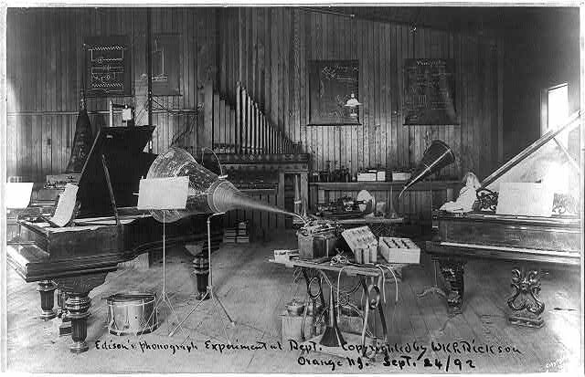
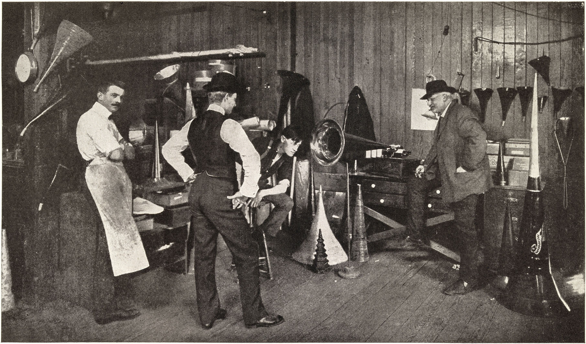
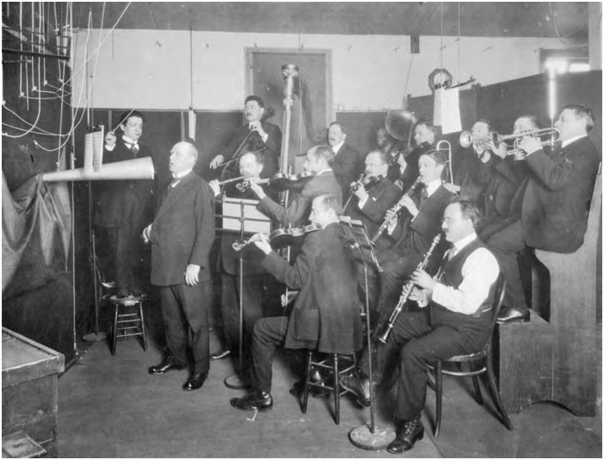

+++
title = "Capturing Sound in the Acoustic Era: Recording Professionals and Clever Mechanics"
outputs = ["Reveal"]
[reveal_hugo]
theme = "moon"
margin = 0.2
separator = "##"
+++

## Capturing Sound in the Acoustic Era

### Recording Professionals and Clever Mechanics

{}
Early phonograph makers and recording companies bore little resemblance to the large entertainment conglomerates they became by the end of the twentieth century. Beginning in small-machine shops and inventors’ laboratories, they could be counted among the many specialty manufacturing firms that composed the largest sector of American production in the late nineteenth and early twentieth centuries. 

The first decades in the development of sound recording involved a great deal of cut-and-try experimentation and refinement of the different components of the recording chain. Much work went into improving the mechanical apparatus, the sound box and diaphragm, the shape and material of the recording horn, and the composition of the wax recording material, but the studio received little attention.
{}

---

**Edison Recording Laboratory - West Orange, New Jersey**

{}
Those studios ranged from the well-equipped Edison Recording Laboratory in West Orange, New Jersey, to office spaces in New York City, to a converted warehouse in Indiana, where recording experts worked to improve the art of capturing sound on record when the art of sound recording was new.

Although the recording studio underwent its most dramatic change after World War II, when the booming record industry became both catalyst for and beneficiary of the growth and development of recording technology, an overview of what the early studio was like and how recordings were made in the decades before this period reveal both change and continuity in the technique and practice of sound recording and are essential for a fuller appreciation of the effect of developments during the postwar period.

the recording studio and the technologies it employs retain vestigial features that can best be understood with some knowledge of their evolution.

Question: What technologies in the recording studio are vestigial features best understood by their evolution? 
{}

---

# 1900s
## Cylinder phonograph vs. disc Gramophone

{}
There were also two methods of inscribing the sound onto wax blanks: vertical or “hill and dale” recording, so named because the stylus traversed the tiny hills and valleys of the groove as it inscribed sound onto the wax surface, and lateral recording in which the stylus moved from side to capturing sound in the acoustic era 
side, inscribing sound in the groove.

Until 1925, recording experts made cylinder and disc records by the acoustical method of recording. The basic difference between acoustical recording and the electrical recording method that replaced it involved the means of capturing and inscribing sound. In the acoustical method, the sounds to be recorded—instrumental and vocal—had to be sung or played into a large recording horn, or several horns of varying sizes, connected to a sound box that housed a diaphragm.
{}

---

## Recording on a cylinder phonograph 

<iframe width="560" height="315" src="https://www.youtube.com/embed/1n2b0NdL6_E?si=AUFS5ZlyQ33ngrUn" title="YouTube video player" frameborder="0" allow="accelerometer; autoplay; clipboard-write; encrypted-media; gyroscope; picture-in-picture; web-share" allowfullscreen></iframe>

---

## Gramophone playing "When Summer is Gone"

<iframe width="560" height="315" src="https://www.youtube.com/embed/d8UE4R_5o9c?si=R1tzonpaLQRf_urz" title="YouTube video player" frameborder="0" allow="accelerometer; autoplay; clipboard-write; encrypted-media; gyroscope; picture-in-picture; web-share" allowfullscreen></iframe>

Also, see [Recording Technology History](https://www.aes-media.org/historical/html/recording.technology.history/notes.html#cylinder)

---

# The Studios of the Acoustical Era 

{}
The first studios were actual laboratories where inventors and mechanics experimented with various methods of capturing sound. Before methods of mass production were refined in the late 1890s, cylinders were recorded in “rounds,” a process that resembled batch production. Recordists and performers simply made multiple copies, up to ten or more at a time, one after the other, to fill the demand

In other sessions, the solo artist bore the burden of repeating performances on a single day. Music Trades Review reported that America’s first black recording artist, George W. Johnson, sang “The Laughing Song” fifty-six times in one day, managing to laugh with “as much merriment . . . at the conclusion as when he started.”5 By the early twentieth century, mass production of cylinders and discs eliminated the need for rounds
{}

---

# Recordists at Working the Studio
## Clever Mechanics

---

> In the recording room . . . there were a number of small
platforms of varying heights, each large enough to hold a
chair and a music stand. The piano, always an upright, had
its back removed. The Stroh violins were nearest the horn.
Muted strings were never mentioned. The French horns,
having to direct the bells of their instruments towards the
recording horn, would turn their backs on it and were provided with mirrors in which they could watch the conductor.

[The-Fabulous-Phonograph-1877-1977-Gelatt](https://worldradiohistory.com/BOOKSHELF-ARH/History/The-Fabulous-Phonograph-1877-1977-Gelatt-1954.pdf)

---

> The tuba was positioned right back away from the horn and
his bell turned away from it; he also watched in a mirror.
The big drum never entered a recording room. . . .
The horns projected into the recording- machine room
through a partition. Here, where the operators worked, was
a shrine of mystery. Nobody was allowed to pass into it.

---

> . . . Yet there was not much to be seen. A turntable
mounted on a heavy steel base, controlled by a gravity
weight, a floating arm with its recording diaphragm. A
small bench, usually strewn with spare diaphragms, and a
heating cupboard where the wax blanks were slightly
warmed to soften the recording surface. Through a sliding
glass panel in the partition the recorder could communicate
with artists and conductor

{}
a circa 1911 reminiscence by the advertising manager of Columbia’s London studio, published in The Gramophone in 1940, describes the recordist’s “shrine of mystery,” which few were permitted to enter, as containing little more than a turntable mounted on a heavy steel base, controlled by gravity weight, a floating arm with its recording diaphragm, a small bench strewn with spare diaphragms, and a heating cupboard where the wax blanks were slightly warmed to soften the recording surface.
{}

---

{}
Recording sessions involving a large number of musicians posed logistical challenges in getting sounds onto disc or cylinder. Because the acoustical recording horn picked up certain sounds effectively but others hardly at all, the necessity of scaling back instrumentation to accommodate the limited capability of the recording horn meant that orchestras and bands for recording purposes and for concert purposes were totally different propositions.

Stringed instruments came across particularly weak but by necessity could not occupy the space in front of the recording horn because that was reserved for the singer (see fig. 2). Violins, violas, cellos, and basses sounded like “a pathetic and ghostly murmur,” so tubas were often substituted for basses, bassoons for cellos, and after the invention of the Stroh violin in 1901, many ensembles used this instrument in place of, or in combination with, conventional violins or violas.1

Other instruments such as the tuba, trombone, and banjo came across so well that they had to be positioned away from the recording horn or their penetrating sounds might make the recording stylus jump the groove and ruin the take.17 Drummers were often limited to playing nothing more than a cymbal and wood block, and occasionally they were replaced by a banjo used as a “tune drum.”1
{}