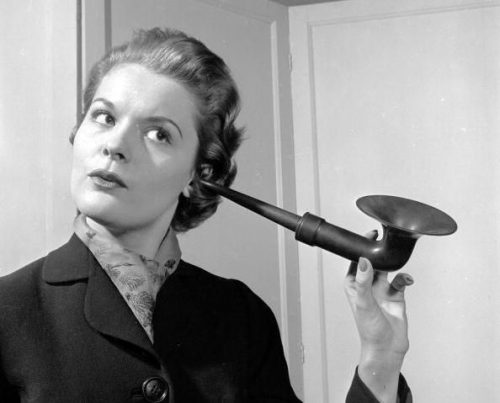
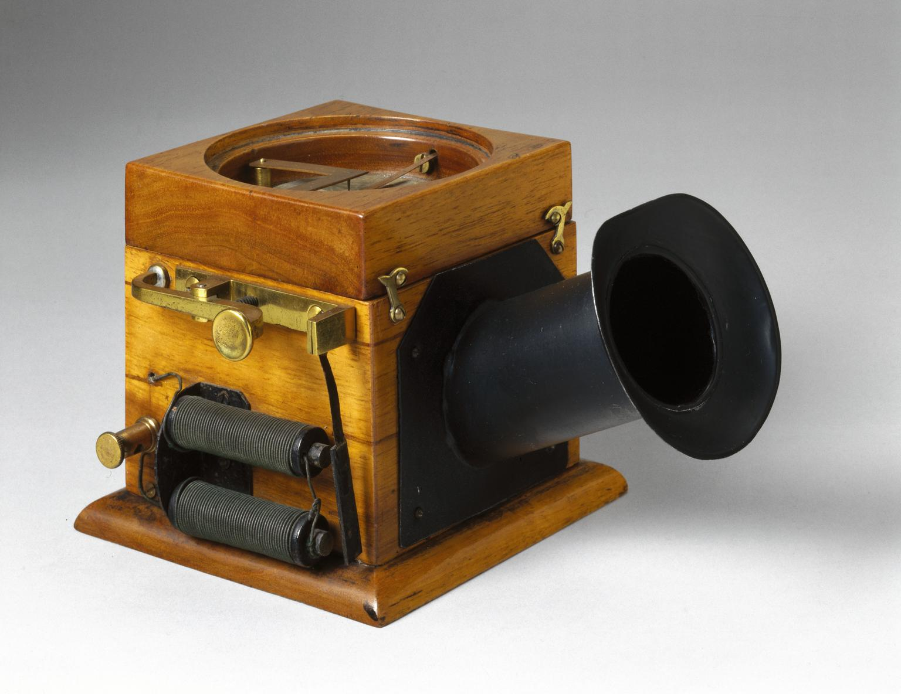

+++
title = "The History and Evolution of the Microphone"
outputs = ["Reveal"]
[reveal_hugo]
theme = "moon"
margin = 0.2
separator = "##"
+++

## Microphone = Small phone

{}
* Greek origin = "small phone"
* Traced back to 1683; defined as "an instrument by which small sounds can be intensified." 
* Microphone was originally a word used to refer to ear trumpets,  the hearing aids of the day. In 1877, the definition shifted to include the conversion between acoustic and electrical signals brought on by the development of the telephone. 

{}

---

## Dr. C. G. Page, 1830-37

<iframe width="560" height="315" src="https://www.youtube.com/embed/YqKWy7ZAvHI" title="YouTube video player" frameborder="0" allow="accelerometer; autoplay; clipboard-write; encrypted-media; gyroscope; picture-in-picture; web-share" allowfullscreen></iframe>

{}
You can see an early experiment with electromagnetism to create a motor. 

In 1837, Dr. C. G. Page was working on experiments in magnetism. He noticed how different sounds were emitted when he changed the magnetism of an electromagnet. His name for this was galvanic music. See a paper describing more about that here: [The Speaking Telephone, Talking Phonograph, and Other Novelties - selection.pdf](https://commons.princeton.edu/motorcycledesign/wp-content/uploads/sites/70/2018/06/selection.pdf). 

{}

---

## M. Charles Bourseul, 1854

<iframe width="560" height="315" src="https://www.youtube.com/embed/sv7bhfVRzLY" title="YouTube video player" frameborder="0" allow="accelerometer; autoplay; clipboard-write; encrypted-media; gyroscope; picture-in-picture; web-share" allowfullscreen></iframe>

> "in a word, if what is spoken in Vienna may not be heard in Paris."

{}

In 1854 M. Charles Bourseul published a paper on the electric transmission of speech. He spoke of "telegraphic marvels" that could produce long-distance handwriting or drawings. From this invention, he wondered if it would be possible to transmit speech by electricity. If, "in a word, if what is spoken in Vienna may not be heard in Paris." He notes experiments in the field but never produced the device he dreamed of.
{}

---

#### Philip Ries, 1860

{}

In 1860, Philip Ries invented the "telephon." His device did not produce intelligible speech but thin and intermittent sound.   His invention was only seen as a scientific toy at the time.  Because many people didn't use his device, history has largely forgotten his name. 
{}

--- 

## Elisha Gray and Alexander Bell, 1876

<iframe width="560" height="315" src="https://www.youtube.com/embed/ijvEJlmSO3E" title="YouTube video player" frameborder="0" allow="accelerometer; autoplay; clipboard-write; encrypted-media; gyroscope; picture-in-picture; web-share" allowfullscreen></iframe>

{}

In 1876, Elisha Gray and Alexander Bell developed telephones to produce intelligible speech using liquid transmitters and magnetic receivers. Because of problems with signal strength, experiments continued through the decades to improve the transmitter/microphone components. 

See examples of many types of early successful transmitters/microphones in the following pages. 

**Liquid Transmitter**

In 1876 Bell demonstrated his "articulate" telephone using his liquid transmitter. See a demonstration on how to create a replica first telephone: [(381) The First Telephone - YouTube](https://www.youtube.com/watch?v=ijvEJlmSO3E). 

See more details here about developments of telephone technology..
{}

