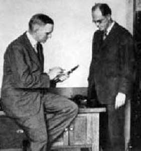

+++
title = "The Studio Electrifies"
outputs = ["Reveal"]
[reveal_hugo]
custom_theme = "reveal-hugo/themes/sunblind.css"
slide_number = true
+++

## The Studio Electrifies

### Radio, Recording, and the Birth of the Small

{}
* “goldenage.” fueld by dance crazes of the 1910s, foxtrot
* By the early 1920s, the spectrum of recorded music had broadened to include more jazz, blues, gospel, and hillbilly music, and new record labels such as Gennett, Okeh, Paramount, Black Swan, Ajax, and Vocalion focused on these niche markets.
* Columbia to begin releasing blues records, and by 1923, the label had signed blues and jazz artists, including Bessie Smith, Fletcher Henderson, Clarence Williams, and Ethel Waters
* Record sales reached **$106 million** in 1921, but as records became the most popular form of home entertainment, a competing entertainment technology, radio, introduced a new way for the listening public to hear music
  * It brings up similar concepts now of other mediums competing with listening to music at home. While the radio did play music, it also played radio plays, sports, and news. Consumers had to own a radio to listen but didn’t have to buy records, so it was probably more popular. 
* **By 1922**, a radio boom had swept the country and record sales began a three-year decline. Radio has been blamed for the recording industry’s reversal of fortunes, but radio ultimately became the catalyst for sweeping changes in sound recording.
  * There have been many culprits to blame for a dip in record sales. Tapes were released in the 80s/90s; in the 2000s, it was online file sharing. 
* **Electrifying the studio** became the most revolutionary improvement in sound recording to date and the first step in transforming recording from the art of capturing sound to the engineering of an illusion.
  * First, more than any other innovation up to that time electrical recording dramatically improved the sound of records. Replacing the recording horn with microphones also eased cramped conditions in the studio. It became possible to record larger-sized ensembles more effectively and thus a broader range of music
* The change from acoustical to electrical recording signified more than a simple improvement in the sound of records; it marked a radical shift with long-term consequences for recording.
* This first revolution in recording technology produced not only better-sounding records but also more of them and more individuals involved in making them.

{}

---

##  From Recording Experts to Engineers

### Transforming the Craft of Recording

---

[Source](https://www.bellsystemmemorial.com/belllabs.html)

{}

* On January 1, 1925, Bell Telephone Laboratories incorporated as a wholly owned subsidiary of American Telephone & Telegraph and Western Electric, thereby officially becoming the second-largest industrial research laboratory in the United States after General Electric. AT&T promoted Bell Labs as a national research laboratory in which the benefits of pure research could be carried over to different scientific, technical, and economic interests
*  recording companies and film industries benefited from Bell's work. 
{}

---

## Improving the sound of records

{}
* The first few decades of sound recording focused on improving the design of records and playback equipment, and a good deal of empirical knowledge about studio recording had been accumulated through trial and error.
{}

---

<iframe width="560" height="315" src="https://www.youtube.com/embed/5aVF2s9Cw6c?si=aCaDB27KgLYEEXsQ" title="YouTube video player" frameborder="0" allow="accelerometer; autoplay; clipboard-write; encrypted-media; gyroscope; picture-in-picture; web-share" allowfullscreen></iframe>

{}

* In 1905, Sir Charles A. Parsons, inventor of the steam turbine, devised a talking machine that employed air pressure, adjustable valves, and a reed-like sound box to intensify sound reproduction. His invention, the Auxetophone, was intended for public use and on a calm day was said to be audible for miles.
* Victor Talking Machine acquired control of the patent in the United States and produced five hundred units, but the device re- quired more routine mechanical attention than expected and initial enthusiasm quickly waned
* Any attempts to acoustically amplify the sound in playback still could not make up for the inadequate volume and limited range of frequencies captured in the initial recording. 
* Many companies and individuals experimented, but no systematic development occurred until after World War I when research into acoustical theory and advances in communication and amplification led to the era of scientific electroacoustics.
{}

---

## Joseph P. Maxfield, 1919

[Source](https://www.stokowski.org/Development_of_Electrical_Recording.htm)

{}
* In the fall of 1919, a team of Bell Labs engineers under the leadership of Joseph P. Maxfield began work on developing electrical recording. Equipped with new tools—condenser microphones, vacuum tube amplifiers, electrical filters, loudspeakers—as well as experience dating back to about 1912 in using acoustic recording and reproducing equipment to analyze speech in the development of the telephone, Bell Labs was uniquely poised to undertake the project.
{}

---

## 1924, First electrical recording of a theatre organ by Marsh

<iframe width="560" height="315" src="https://www.youtube.com/embed/JDmsggZM_Uk?si=mUwUXWSmXgfQHoi1" title="YouTube video player" frameborder="0" allow="accelerometer; autoplay; clipboard-write; encrypted-media; gyroscope; picture-in-picture; web-share" allowfullscreen></iframe>

{}
More than a dozen others were known to have experimented with electrical recording between 1919 and 1925. The most successful was Orlando Marsh of Chicago, but others never publicized their efforts because of either competitive secrecy or failure to achieve satisfactory results.1
{}

---

## The problem 

> “taking sound from the air, storing it in some permanent way and reproducing it again without appreciable distortion...”

{}
* Analyzing the problem before them, of “taking sound from the air, storing it in some permanent way and reproducing it again without appreciable distortion,” the Bell engineers examined the existing acoustical methods of both recording and reproduction.
* By using condenser microphones and vacuum-tube amplifiers, and devising an electromagnetic rubberline recorder and reproducer based on the principle of mechanical analogs of electrical filters that had been developed for telephone systems, they eliminated most—but not all—of the major problems associated with acoustical recording and reproduction
* The new electrical recording chain reconfigured the studio and recording room and gave the recordist—still a few years from being referred to as the recording engineer—increased control. Instead of a horn protruding through the wall or dominating the center of the room, performers now sang into a microphone connected by wire to the recording room that housed the amplifier and electromagnetic recorder. 
* Created the: recording amplifier system, the amplified equivalent of the acoustic recording horn and sound box. The recording horn, diaphragm, and cutting stylus of the acoustical system had been replaced by the condenser microphone, vacuum tube amplifier, and electromagnetically powered cutting stylus
{}

---

{}
* A more revolutionary change involved the introduction of completely new components to the system: a volume indicator for measuring the power delivered to the recorder and an audible monitoring system, enabling the operator to listen during recording. Instead of only listening and determining proper balance by ear, or by inspecting the grooves after recording, the recordist could now see the signal level being recorded and adjust accordingly (see fig. 3). 
* With the electrical process, monitoring the performance as the recording was under way enabled the recordist to experiment with adjusting levels in the course of a single take, thus saving time and wax, and relieving artist and recordist alike of the tedium of repeated tests until the proper balance had been struck. 
{}

---

## Maxfield-Harrison improvements

1. Bass and higher harmonics
2. Records could have “atmosphere” or “room tone,” AKA reverb. The microphone could be placed further from the source, picking up room acoustics. 
3. The records seemed louder because of the range of reproducible tones. More high frequencies make the recordings seem louder than they measurably are. 

---

<iframe width="560" height="315" src="https://www.youtube.com/embed/pBbilGx-HB8?si=YvZ5bOM6V0X3ATGg" title="YouTube video player" frameborder="0" allow="accelerometer; autoplay; clipboard-write; encrypted-media; gyroscope; picture-in-picture; web-share" allowfullscreen></iframe>

{}
**However, Maxfield and Harrison had only electrified recording—not the phonograph, the system of reproduction.** To accommodate the disparity, they designed an improved acoustical-mechanical phonograph and reproducer based on the electrical principles of resistance and matched impedance, thus ensuring that the wider frequency range captured in the recording would be transmitted in playback.25 The results of Maxfield and Harrison’s research, the Orthophonic Victrola, became the first consumer phonograph specifically designed to play electrically recorded discs and reproduce the wider frequency response they offered.
{}

---

##  Diffusion of Electrical Recording into Record Company Studios

{}
* In 1924, they approached the Victor Talking Machine Company and the Columbia Phonograph Company about acquiring rights to the new recording process. **Victor executives hesitated**, and **Columbia**, which had gone into receivership in October 1923 after debilitating losses following overproduction and the 1921 business depression, **was not in a position to license the system.**
* In the meantime, Sir Louis Sterling of **Columbia Graphophone Company in England**, which had been actively involved in electrical recording experiments of its own since 1919, learned of the Bell Labs development and hoped to acquire the Western Electric system for British Columbia. 
* Sterling’s faith in the superiority and ultimate commercial potential of electrical recording can be gauged by his investment: **$2.5 million for Columbia Phonograph and $50,000 for the Western Electric licensing fee**, plus a royalty on each record made by the process

{}

---

## Louis Sterling

[Source](https://soundofthehound.com/absent-friends/sterling-louis-1879-1958/)

{}
* Columbia’s Louis Sterling was a self-made businessman who had worked his way up from New York’s Lower East Side to become a manager of record companies—first an English cylinder company and then Columbia. He had an innate business sense but was not an inventor and apparently had no allegiance to a particular embodiment of recording technology. 
* Victor president Eldridge Johnson, by contrast, had built up his company from the beginning with technology of his own making. He believed firmly in Victor’s expertise with acoustic recording and, although keenly aware of its shortcomings, Victor engineers and recordists sought to improve the existing method (acoustical recording) over adopting a radically new one (electrical recording). 
* This commitment, coupled with ever-increasing record sales as its competitors suffered declines, explained Victor’s reluctance to change. They had too much invested in the status quo, and the status quo worked. 
{}

---

## Associated Glee Clubs of America: "John Peel" (1925) 

<iframe width="560" height="315" src="https://www.youtube.com/embed/nDUvgyyXcgM?si=y2USUKzzAHIT_ysV" title="YouTube video player" frameborder="0" allow="accelerometer; autoplay; clipboard-write; encrypted-media; gyroscope; picture-in-picture; web-share" allowfullscreen></iframe>

{}
- On March 31, 1925, Columbia staged a dramatic public experiment to demonstrate the new capabilities of electrical recording equipment. Suspending a single microphone from the ceiling of the Metropolitan Opera House, they recorded a concert arranged by the Associated Glee Clubs of America, featuring fifteen glee clubs comprising 850 voices, thirteen different conductors—one each for the thirteen numbers performed—and a finale in which the entire audience was invited to join in and sing. 
- Columbia quickly processed and released its first electrical record, a twelve-inch disc of “John Peel” sung by the glee clubs, and “Adeste Fidelis,” which featured the glee clubs and the audience, amounting to thousands.
{}

---

##  The New Studio

{}
* The layout of the new electrical recording studio differed only in degree from that of the acoustical studio. The recordist and recording equipment still occupied a separate room adjacent to the studio in which the artists performed, but the separation had begun to grow more distinct, with triple-pane glass and soundproof partitions between control room and studio.
* Now, he had control through knobs at his fingertips and the ability to communicate with the studio through an **intercom system** like that used in radio broadcast studios. The necessary separation not only provided protection for the recording equipment, which was sensitive to vibrations, extraneous noise, and environmental conditions, but also provided what amounted to a barrier between artist and technician, a boundary between realms, and a stronger distinction between their respective roles. I
{}

---

* Frank Baur's benefits of electrical recording: 
  * (1) better-sounding records, 
  * (2) less strain on the performer, and 
  * (3) less time to make a record

{}
* The microphone, a more sensitive instrument, not only picked up a wider frequency range but also reacted to environmental conditions; heat, humidity, and vibrations plagued electroacoustical devices even more than they affected acoustical equipment.
* From the recordist’s perspective, the key benefits of electrical recording were greater control and measurability. 
  * More control over the output of a record meant more care needed to be taken into the space’s acoustics because they were getting more faithfully recreated on the record. 
  * The acoustical recording had opposite room acoustics requirements than we think of today, as studios typically have dead acoustics for most uses. Some instruments are recorded with live reverb, such as drums, because it helps blend the different parts of the set. 
  * However, the “sonorous reflections” that served to enhance acoustical recordings proved difficult to control when using the more sensitive condenser microphone with an omnidirectional pattern; whereas the acoustical horn collected only those sounds directed toward it, the condenser microphone picked up virtually all sounds indiscriminately.
{}

---

<iframe width="560" height="315" src="https://www.youtube.com/embed/mcrx2-vvwC4?si=SXBJH0jGedvh1Ecx" title="YouTube video player" frameborder="0" allow="accelerometer; autoplay; clipboard-write; encrypted-media; gyroscope; picture-in-picture; web-share" allowfullscreen></iframe>

{}
* The session took place in Columbia’s New York studio, located at Broadway and Fifty-Ninth Street, on May 5, 1925, a month after the company’s first electrical recording “experiment” with the chorus of thousands at the Metropolitan Opera House. 
* On hand were the Columbia recordists and several Western Electric engineers, in addition to recording director Frank Walker, Smith, and her accompanists, the Fletcher Henderson Hot Six. 
* The Western Electric engineers determined that the large studio required some acoustical damping, so they rigged a tent of monk’s cloth from the ceiling to cover the singer, the musicians, Walker, and the engineers. During the session, the ceiling wires holding the conical tent snapped, “reducing everyone to a mass of bobbing bubbles under a sea of monk’s cloth,” said producer George Avakian. “That was the end of the session—and the tent theory of electrical recording.” 
{}

---

## WCAU in Philadelphia with "live end-dead end"

{}
In 1932 radio stations began to adopt a “live end–dead end” approach to studio acoustics. The “live” end of the broadcasting studio, free of absorbent materials, provided localized reverberation that facilitated musical performance, while the “dead” end of the room kept the effective reverberation at the microphone to the desired low value. Radio station WCAU in Philadel- phia, the first purpose-built broadcasting facility in the United States, became the first to incorporate this approach.
{}

---

## Intimacy of the microphone  

- [(292) Nick Lucas - When I Think of You (1925) - YouTube](https://www.youtube.com/watch?v=FoAfYmE655s)
- [(292) I Wanna Go Where You Go (Recorded 1925) - YouTube](https://www.youtube.com/watch?v=U_a-XGxcRWk)
- [(292) 1925 HITS ARCHIVE: Yes Sir, That’s My Baby - Gene Austin - YouTube](https://www.youtube.com/watch?v=yXV4cRkQdsQ)

---

##  Recording circa 1927: New Freedom in the Studio

{}
* Most important, the new method enabled musicians to play more freely, an essential component of the emerging hot jazz style.
* The freedom expressed in jazz, its unrestrained solo improvisation, blurred distinctions between composer and performer and brought performer and audience closer. More intimate than formal music, its evolution paralleled the changing technology of recording.
* Wow, the idea here is that this technology enabled the development and distribution of jazz. Recording is essential for jazz, as it’s primarily improvised music, not easily transcribed in sheet music. 
{}

---

## Okeh Records

[Okeh 78 records | THE VINTAGE RECORD PLAYLIST: 78-RPM AND CYLINDER RECORDS](https://78records.wordpress.com/category/okeh-78-records-2/)

{}
Listen to the various recordings 
{}

