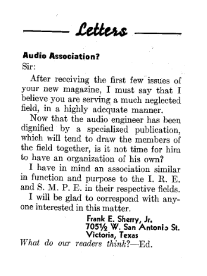

+++
title = "The Audio Engineering Society, Audio Fairs, and Audiophiles"
outputs = ["Reveal"]
[reveal_hugo]
custom_theme = "reveal-hugo/themes/sunblind.css"
slide_number = true
+++

# The Audio Engineering Society, Audio Fairs, and Audiophiles

[Audio Engineering - May 1947](https://worldradiohistory.com/Archive-All-Audio/Archive-Audio/40s/Audio-1947-May.pdf#page=6)

{}
The term audio engineering was a relatively new one in the postwar period, so new that there was no publication devoted to it until 1947. Early that year, Radio magazine announced that it would be changing its name and focus to Audio Engineering, starting with the May issue. “Because there has been no technical magazine devoted solely to this field,” explained editor John H. Potts, “all engineers interested in audio engineering have had to gather piecemeal, from a large number of sources, such information on the subject as is published.”

The problem with no industry sharing of knowledge: 

Cutting and mastering techniques had long been highly individualistic. Re- cording engineers did their best to mask the surface noise on records by boosting frequencies in the high ranges as the records were mastered (pre-emphasis); likewise, they rolled off the bass response to limit groove width. Each record and transcription company established its own “recording curve,” or “recording characteristic,” which meant that commercial phonograph records then had widely varying levels of volume and tone.

How could recording professionals and other audio-related industries arrive at standards if they had no recognized umbrella organization within which to effectively discuss and resolve these problems?
{}

---

[Letter](https://www.aes.org/aeshc/pdf/how.the.aes.began/sherry.pdf)

{}
By the end of 1947, a letter appeared in Audio Engineering seeking all those interested in forming an “Audio Association.” Since they now had a magazine serving the neglected field of audio, was it not time to form an association similar in function and purpose to the IRE and the SMPE in their respective fields?82 A reply to the letter, printed in the following issue, stated that “a group of us, long active in broadcasting and recording, feel the same way. Audio engineering will be unhampered only when it has a society devoted exclusively to its needs— controlled by, and only to benefit, the audio engineer.

1948

At the third meeting, held in the same location on March 11 and considered the first official meeting of the Audio Engineering Society, renowned acoustical en- gineer and inventor Dr. Harry Olson of RCA gave a loudspeaker demonstration and technical paper on “Some Problems of High Fidelity Reproduction.”
{}

---

<iframe src="https://ia802305.us.archive.org/3/items/sim_junior-scholastic_1949-12-07_25_11/sim_junior-scholastic_1949-12-07_25_11.pdf#page=47" width=800 height=600></iframe>

{}
## First AES Convention, 1949

In October 1949, the AES, which by then had quintupled its membership, held its first convention at the Hotel New Yorker. Part of this meeting included a manufacturers’ display of sound recording and reproducing equipment, a professional exhibit that was open to the public and came to be known as the Audio Fair.
{}

---

## Edward Tatnall Canby

* [Edward Tatnall Canby: Reviewer, Critic, Audiophile, Conductor, Teacher & Host | NYPR Archives & Preservation | WNYC](https://www.wnyc.org/story/140336-edward-tatnall-canby-reviewer-critic-audiophile/) 
* [The Saturday review home book of recorded music and sound reproduction](https://archive.org/details/saturdayreviewho00canb/page/n9/mode/2up)

{}
Edward Tatnall Canby, an audio enthusiast, teacher, arts critic, and founding AES member, routinely covered these Audio Fairs for Saturday Review. His record reviews for that popular literary magazine included critical assessment of the engineering, as well as the performance and content of the records he reviewed. Canby, who was knowledgeable about the science and art of recording technology, epitomized the burgeoning community of technically educated reviewers in the era of high fidelity.
{}

---

## Discuss articles you choose from the first issue 

{}
The first issue of the Journal of the Audio Engineering Society in January 1953 contained thirty articles that revealed how long the AES had been waiting for this opportunity to publish papers, even though Audio Engineering regularly published AES news as well as some technical papers.
{}