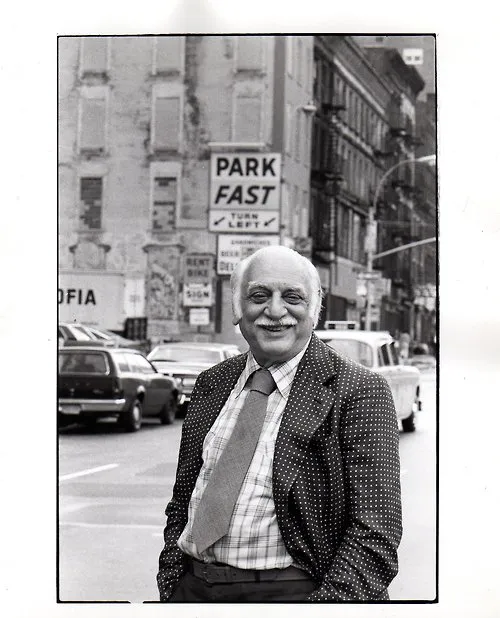
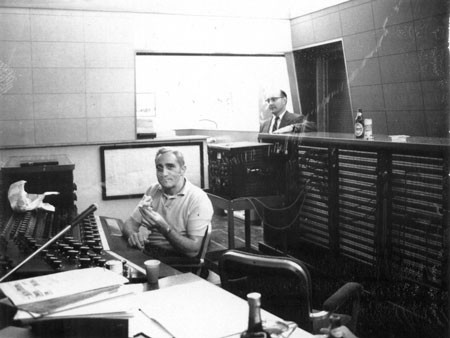

+++
title = "Capturing the Moment, Falling in Love with the Phonograph: Amateurs and the Growth of Interest in Recording"
outputs = ["Reveal"]
[reveal_hugo]
custom_theme = "reveal-hugo/themes/sunblind.css"
slide_number = true
+++

# Capturing the Moment, Falling in Love with the Phonograph

##  Amateurs and the Growth of Interest in Recording

{}
* Amateurs played an important role in the development of recording technology 
* amateur recordists found excitement in technical tinkering and, much later, the sheer exhilaration of high-fidelity sound.
* The transformation of the recording industry after World War II resulted from a series of developments both inside and outside the recording studio, including 
  * technological innovation, 
  * economic prosperity, 
  * increased leisure time, and 
  * a growing demand for entertainment and consumer goods.
{}

---

<iframe frameborder="0" scrolling="no" style="border:0px" src="https://books.google.com/books?id=hT8IAAAAIAAJ&newbks=0&dq=the%20phonograph%20and%20how%20to%20use%20it&pg=PA3&output=embed" width=500 height=500></iframe>

{}
Cylinder phonographs and records became available to the public in the early 1890s, and all were equipped with a recorder and some blank records.4 In 1900, Thomas Edison’s National Phonograph Company encouraged a variety of uses for its recording phonographs through an instructive booklet entitled The Phonograph and How to Use It

Three parts:
- history 
- operation of models
- testimonial and usage of phonograph for the amateur 

In one chapter, a woman recounted how she and her sister gave a “phonograph party,” recording their guests and playing back the results to the delight and dismay of the attendees, who quickly discovered why, as the book warned, “the amateur will do well to avoid the sorrow that is almost inevitable in attempting to make a record of a high tenor, a soprano or a violin.”
{}

---

## Ethnomusicology 

* Native American ethnographic recordings
  * [1890 Passamaquoddy Phonograph Recordings | Passamaquoddy People](https://passamaquoddypeople.com/collection/1890-passamaquoddy-phonograph-recordings)
* [Northcote W. Thomas Cylinder Collection | The British Library](https://www.bl.uk/collections/nw-thomas-cylinders)

{}
Early amateur recording activity focused on preservation and documentation—on capturing the moment like a snapshot in sound. Scientists were among the first to perceive the usefulness of recording devices for studying the nature and evolution of language, and ethnographers quickly recognized the phonograph as a tool for capturing and preserving Native American languages and other folklore.

Presaging what would become standard practice decades later, musicologists encouraged musicians to record their original compositions and improvisations rather than risk losing spontaneous inspiration through inability to notate quickly the ideas as they occurred to them.12 These users rarely, if ever, ventured beyond recording for documenting, studying, or analyzing some
event or expression. For them, the recording phonograph was a tool for study rather than a source of entertainment or an object for tinkering.
{}

---

<iframe width="560" height="315" src="https://www.youtube.com/embed/YPl8pzlLhQQ?si=N714kKFuaiXUmWW9" title="YouTube video player" frameborder="0" allow="accelerometer; autoplay; clipboard-write; encrypted-media; gyroscope; picture-in-picture; web-share" allowfullscreen></iframe>

{}
In 1920, Pathé introduced its Voicewriter, a home recording system that employed embossed aluminum discs, and several other companies soon introduced pregrooved discs as well. RCA introduced a recording attachment for its radio-phonograph combination, the Radiola 86, which involved a switch enabling the owner to record on pregrooved plastic discs. 

{}

---

[RADIO-CRAFT- Hugo Gernsback consumer radio magazine 1929 to 1948](https://worldradiohistory.com/Radio_Craft_Master_Page_Guide.htm)

{}
Interest in sound recording, public address, reproduction, all things audio had grown tremendously during the 1920s and 1930s as radio broadcasting flourished, offering opportunities to enterprising radio servicemen and ham radio enthusiasts who wanted to turn a hobby into a part-time business. 

Beginning with his first publication in 1908, Modern Electrics publisher and electronics entrepreneur Hugo Gernsback had become an avid promoter of amateur radio and home recording.18 His next periodical, The Electrical Experimenter, was the first to report Charles Apgar’s achievement in 1915, and in July 1929, he began publishing Radio-Craft magazine, aimed at the serviceman, dealer, and “radiotrician.” The December 1930 issue featured the first of many articles on home recording as “the latest adjunct to radio.”
{}

---

* Sential chromatrola - [HOMERECRADIO.pdf](https://durenberger.com/wp-content/uploads/2018/08/HOMERECRADIO.pdf)

{}
Home recording grew in popularity as companies offered kits and radio-phonograph combinations with home-recording attachments, including the Presto home recording kit, the Radiola 86, the Sentinel Chromatrola, and the Audak Musichrome.
{}

---

<iframe src="https://worldradiohistory.com/hd2/IDX-Site-Early-Radio/Archive-Radio-Craft-IDX/IDX/30s/35/Radio-Craft-1935-11-OCR-Page-0018.pdf" width=500 height= 700></iframe>

[Radio-Craft-1935-11-OCR-Page-0018.pdf](https://worldradiohistory.com/hd2/IDX-Site-Early-Radio/Archive-Radio-Craft-IDX/IDX/30s/35/Radio-Craft-1935-11-OCR-Page-0018.pdf)

{}

Arthur Heine of the Speak-O-Phone company promoted his firm’s product, a portable disc recorder, not as an expensive hobby but as a business opportunity: “A profitable business medium has been found in ‘recording studios,’ which the radio man may establish at little expense.”
{}

---

## Recording Instruction

* [Radio-News-1941-04-R.pdf](https://worldradiohistory.com/Archive-Radio-News/40s/Radio-News-1941-04-R.pdf) - pg 20
* [The Recording and Reproduction of Sound (Oliver Read) 1952](https://archive.org/details/The_Recording_and_Reproduction_of_Sound_Oliver_Read_1952/page/18/mode/2up)

{}
In addition, by the late 1940s, an increasing number of instructive articles, books, and pamphlets on the art of recording helped open up the recording field to more participants.
{}

---

Moses Asch

Asch Records - [Art Tatum : Art Tatum](https://archive.org/details/78_art-tatum_art-tatum-james-swift-tatum_gbia0005678/01+-+Fine+And+Dandy+-+Art+Tatum+-+James+-+Swift-restored.flac)

{}
* Moses Asch started as a radio repairman in 1926 but always considered him- self a tinkerer and inventor.
* When the Depression severely cut into his business, he went into partnership with an electronics firm, Radio Laboratories in Brook- lyn, New York. In 1938, one of its clients, radio station WEVD, required record- ing services for some of its programming, so Asch set up a small disc-cutting studio in a section of Radio Laboratories, by then located in the station’s build- ing at 117 West Forty-Sixth Street in Manhattan.
* fter the partnership dissolved in 1940, Asch advertised as Asch Recording Studios. In addition to transcription ser- vices, Asch continued to record ethnic and folk music genres, niche markets not well served by the major record labels during the Depression but which never- theless continued to have wide audiences. 
* This music became the basis for what would grow into Folkways Records, a label that profoundly influenced a rising generation of folk musicians who found inspiration in the old-time music Asch documented.
{}

---

## Folkways Records

* [Folkways Records | Smithsonian Folkways Recordings](https://folkways.si.edu/folkways-records/smithsonian)
* [Koto: Music of the One-string Ichigenkin | Smithsonian Folkways Recordings](https://folkways.si.edu/isshi-yamada/koto-music-of-the-one-string-ichigenkin/world/music/album/smithsonian)

---

Frank Laico

{}
One of his most notable achievements was working as the chief engineer at the legendary recording studio, Capitol Studios in New York City, where he played a crucial role in recording sessions for artists like Frank Sinatra, Miles Davis, Nat King Cole, and many others. His expertise in recording technology and his ability to capture the essence of live performances in the studio made him highly respected in the field of audio engineering.

World Broadcasting, the largest transcription program service: 
Walking to different floors during his free time, one day he followed the sound of music, pushed open a heavy door and found himself in the recording room. “I found that so exciting,” Laico recalled, “I went in very quietly and started talking to the people in there, and I got fascinated, so I kept coming back.”37 Deciding that he would prefer this work to running the mimeo- graph machine, Laico asked the engineer in charge, Harold Lester, how he might transfer to the recording department.

Within two years, Laico was running one of World’s three studios and earn- ing a substantial raise

{}

---

<iframe width="560" height="315" src="https://www.youtube.com/embed/1_4Jjm3MMiU?si=xlK9vSHNXCRJ180T" title="YouTube video player" frameborder="0" allow="accelerometer; autoplay; clipboard-write; encrypted-media; gyroscope; picture-in-picture; web-share" allowfullscreen></iframe>

{}
In 1943, he was drafted

Laico was soon reassigned to the Signal Corps operation at Bell Labs on West Street in New York City, where he found himself working on one of the most high-level security projects of World War II, the secure speech transmission work of Bell Labs.

“Project X,” as it was known at Bell Labs, focused on creating a true secrecy system for speech and became one of the most closely guarded projects of World War II and for years after.41 The system involved having a key with six random levels. Laico worked on the key production and synchronization, recording the key on high- quality phonograph records. The project’s success hinged on the precision of the recording process and thus demanded very accurately driven turntables used for making the records as well as for playing them back at the terminals.
{}