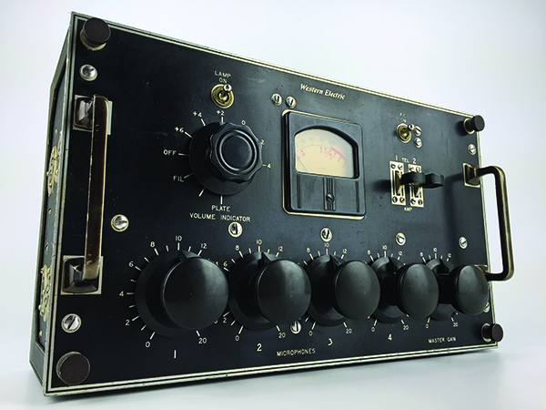
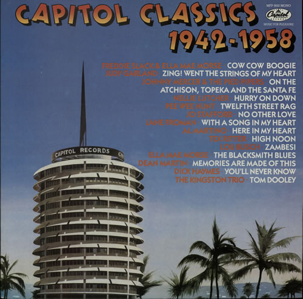
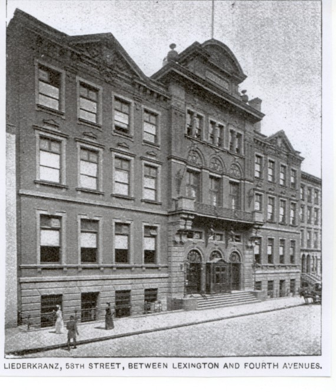
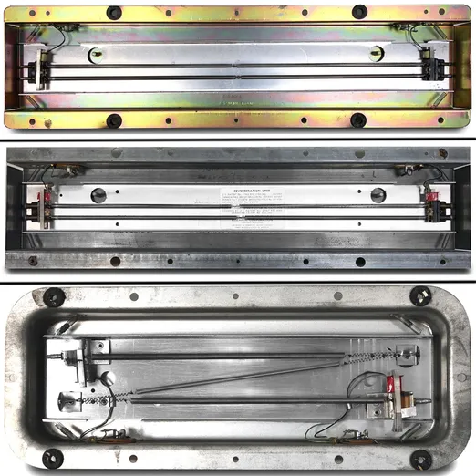

+++
title = "Record Boom: The Record Industry, Broadcasting Studios, and Recording Studios"
outputs = ["Reveal"]
[reveal_hugo]
custom_theme = "reveal-hugo/themes/sunblind.css"
slide_number = true
+++

# When High Fidelity Was New

## The Studio as Instrument

{}

**Recording studio developments**

- Record sales rebounded before World War II, leading to increased attention on record quality and studio acoustics.
- Records couldn't replicate live performance reverberation due to limitations like extraneous noise from shellac discs and limited phonograph frequency range.
- In the 1920s, issues with reverberations and echoes led studios to adopt acoustically dead environments to minimize these problems.
- Early 1930s saw the use of "live end" and "dead end" studios and echo chambers in radio stations to enhance music and speech broadcasts.
- Halls and churches with natural reverberation characteristics became preferred recording environments, gaining a strong reputation.
- Recording studios developed unique acoustical signatures known as their "sound."
- Engineers devised methods to recreate these acoustics in smaller spaces.

**Reverb**

- Reverberation, once eliminated from public spaces and movie sound studios, gained importance in music recording during the early days of high fidelity.
- It was valued not only for aiding singers but also for making records sound louder.
- Controlling reverberation became essential for successful utilization in recordings.
- Achieving a realistic sound required the skillful manipulation of recording equipment and microphone placement by recording engineers.
- Some record producers aimed to go beyond replicating live performances, emphasizing additional elements for the listener.
- This shift marked an increased significance of studio technology, design, and the roles of producers and engineers in recording sessions.

{}

---

# Record Boom: The Record Industry, Broadcasting Studios, and Recording Studios

---

## Decca Records 

<iframe width="560" height="315" src="https://www.youtube.com/embed/VRwXZp6WqS0?si=HJaScj5CZwBbLV4t" title="YouTube video player" frameborder="0" allow="accelerometer; autoplay; clipboard-write; encrypted-media; gyroscope; picture-in-picture; web-share" allowfullscreen></iframe>

[Music: 35-cent Records - TIME](https://content.time.com/time/subscriber/article/0,33009,748024,00.html) 

{}
The upswing in record sales began in 1934 when RCA revived its long-dormant recording division by advertising phonograph records in radio trade magazines, and a new company, Decca Records, introduced the thirty-five-cent record that featured jazz and popular music by name artists such as Bing Crosby, Chick Webb, Ella Fitzgerald, and the Mills Brothers
{}

---

## More Decca

* [‎Decca Records: Country in the '30s and '40s on Apple Music](https://music.apple.com/us/playlist/decca-records-country-in-the-30s-and-40s/pl.4ebadd2dfcc9481d8b1548e3a2999f29)
* [‎Decca Records: Jazz and Blues in the '30s and '40s on Apple Music](https://music.apple.com/kn/playlist/decca-records-jazz-and-blues-in-the-30s-and-40s/pl.5c7f7e24aacb4502befd22918670e508)

---

<iframe src="https://worldradiohistory.com/Archive-Radio-News/30s/Radio-News-1938-12-R.pdf#page=27" style="width: 100%; height: 600px"></iframe>

{}
- In 1938, Lafayette introduced the “modernized” home phonograph with “bass boosting” and “high fidelity” response. This phonograph was marketed as more capable of faithfully reproducing the improved quality of records.
- The popularity of jukeboxes and swing bands and the continued improvement in the quality of re- cords and phonographs further fueled record sales, which, by 1939, had reached an annual gross figure of $36 million industry-wide, six times the sales figure of 1933, the industry’s worst year.
{}

---

<iframe src="record-renn.pdf" style="width: 100%; height: 600px"></iframe>

{}
Moreover, consumers had grown more musically and technically sophisticated; even young listeners, according to one New York Times report, debated the relative merits of pickups, amplification, and needles “with the glibness of scientists’ shoptalk.”
{}

---

## The Record Book

<iframe width="700" height="450" src="https://hdl.handle.net/2027/uc1.b3133167?urlappend=%3Bui=embed"></iframe>

{}
Books to guide the uninitiated record collector in assembling a sound library critiqued everything from artists’ performances to the material quality of recording and pressing
{}

---

## V-Discs

V-Disc recordings [| RSA](https://rsa.fau.edu/album/48228)

<iframe width="560" height="315" src="https://www.youtube.com/embed/SzcILoHba8I?si=70Cd1lgo26CYdM7j" title="YouTube video player" frameborder="0" allow="accelerometer; autoplay; clipboard-write; encrypted-media; gyroscope; picture-in-picture; web-share" allowfullscreen></iframe>

{}

- V-Discs were records made for US military personnel during World War II.
- The AFM imposed a recording ban during the war, but made an exception for V-Discs.
- This allowed musicians to continue working and earning a living during the war.
- V-Discs were a morale boost for US military personnel around the world.
- Over 8 million V-Discs were produced and distributed during the war years.

{}

---

# The Modern Broadcast Studio: NBC Radio City and CBS

<iframe width="560" height="315" src="https://www.youtube.com/embed/iXVzXbEYlrE?si=0rCNxoIqOYqE-Pv3" title="YouTube video player" frameborder="0" allow="accelerometer; autoplay; clipboard-write; encrypted-media; gyroscope; picture-in-picture; web-share" allowfullscreen></iframe> 

{}
Radio City studio complex: 

- Completed in 1933 in New York City
- Cost $5 million, more than half of which was used for sound equipment and acoustic treatment

> THE world's largest and finest radio -broadcasting studios are now in operation at Radio City, New York. Built by the National Broadcasting Company at an outlay of five million dollars, they incorporate many novel features of design and arrangement, in addition to their sheer size and completeness. Thirty-five studios of various sizes are p

**Acoustic treatment in Radio City studio complex**

* Floating construction of walls
* Triple-pane plate-glass observation windows
* Rock wool
* Perforated asbestos tiles
* Proprietary materials: Rockoustile, Acoustone, Acousti-Celotex
* Acoustic treatment on the walls and within the building's air ducts

**NBC's design criteria**

* Not set by the critical judgment of a few people
* Based on years of operating experience and the collective judgment and opinion of thousands of listeners
* Broadcast studio design is no longer a matter of guesswork or trial and error methods
* It is also determined by what sounds good to the listening public

{}

---

CBS Studios 

<iframe src="https://usmodernist.org/AF/AF-1940-09.pdf#page=89" width=700 height=700></iframe>

{}
In 1940, CBS remodeled a former school of music located across the street from its East Fifty-Second Street headquarters for its new broadcasting studios. The designers incorporated innovations in room design and acoustical treatment “intended to result in studios more ‘live,’ or brilliant, than any built up to the present time.”
{}

---

# Recording Studios: RCA Victor, Decca, Columbia, Capitol

---

##  RCA Victor

<iframe src="http://www.scottymoore.net/studio_rca.html" style="width:100%;height:700px"></iframe>

{}
RCA Victor New York studios

- Located at 155 East Twenty-Fourth Street from 1936 to 1969
- Far from the bustle of Midtown Manhattan, nestled between Miller’s Harness Store and a stable on the block between Lexington and Third Avenues

Here are the bullet points of the website http://www.scottymoore.net/studio_rca.html:

* Elvis Presley and Scotty Moore recorded at RCA Studio B in Nashville, Tennessee, from 1954 to 1960.
* Studio B was a small, cramped room, but it had excellent acoustics.
* Presley and Moore recorded many of their biggest hits at Studio B, including "Heartbreak Hotel," "Hound Dog," and "Jailhouse Rock."
* Studio B was also used by other artists, such as Hank Williams, Roy Orbison, and Dolly Parton.
* In 1977, Studio B was designated a National Historic Landmark.

I hope this is helpful!

{}

---

<iframe width="560" height="315" src="https://www.youtube.com/embed/R5SDdUosZEQ?si=1hJbI_rFNV31Wb5M" title="YouTube video player" frameborder="0" allow="accelerometer; autoplay; clipboard-write; encrypted-media; gyroscope; picture-in-picture; web-share" allowfullscreen></iframe>

{}
**Summary of https://swingandbeyond.com/2018/09/09/victors-24th-street-new-york-recording-studio-cherokee-1939-charlie-barnet/ in bullet points:**

* Victor's 24th Street recording studio in New York City was one of the most advanced studios in the world when it was built in 1929.
* Many of the biggest names in music recorded at Victor's 24th Street, including Bing Crosby, Louis Armstrong, and Duke Ellington.
* In 1939, Charlie Barnet recorded his version of "Cherokee" at Victor's 24th Street.
* Barnet's recording of "Cherokee" is considered to be one of the most influential recordings of the swing era.
* "Cherokee" was one of the first tunes on which Charlie Parker began his experiments which led by the early 1940s to the development of the jazz idiom called bebop or more simply, bop.

**Conclusion:**

Victor's 24th Street recording studio was a landmark in the history of music. It is where many of the biggest names in music recorded their hits, and it is where Charlie Barnet recorded his groundbreaking version of "Cherokee."
{}

---

## Western Electric 22C console

{}
The studio had padded walls and rugs on the floor, a control room with a simple RCA recording console, and since the recording was made on hot wax, the musicians could not hear a playback until they received test pressings a week later.
{}

---

- [(322) Recreating the Vintage Sound of Sinatra with the RCA 44 - YouTube](https://www.youtube.com/watch?v=Shjz0p7JJLs)
- [RCA Type 77-DX](https://coutant.org/rca77dx/)
- [(322) Exploring my legendary RCA Type 77-DX Ribbon Microphone - YouTube](https://www.youtube.com/watch?v=w0mbBD5i7Yw)

And finally: [(322) CLASSIC BROADCAST MICROPHONES - YouTube](https://www.youtube.com/watch?v=FAIND_KWp4g) - a long documentary demonstrating many microphones used in radio broadcast including the RCA 77

{}
- Recording consoles in recording studios evolved from the original control panels of the Western Electric electrical recording system.
- RCA Victor and Columbia Recording used consoles designed and built by their respective engineering departments.
- Smaller recording studios utilized broadcast consoles manufactured by companies such as RCA, Raytheon, Western Electric, and Gates Radio.
- The engineer's control over the consoles primarily included adjusting input volume from microphones and output to the disc cutter, as well as balancing instruments.
- The popular microphones during the era were RCA ribbon microphones, specifically the diamond-shaped RCA 44 bidirectional and the bullet-shaped RCA 77 unidirectional.
- These microphones were developed in the early 1930s in RCA laboratories under the guidance of Dr. Harry Olson.
- RCA 44 and RCA 77 microphones became widely adopted in studio recording during the 1930s and 1940s.
{}

---

## Decca Records 

<iframe width="560" height="315" src="https://www.youtube.com/embed/_FnB8VChWf8?si=RU8w6sOeBYbTANMu" title="YouTube video player" frameborder="0" allow="accelerometer; autoplay; clipboard-write; encrypted-media; gyroscope; picture-in-picture; web-share" allowfullscreen></iframe>

{}
* George Avakian's first recording session was at Decca Records in 1939. He was a 20-year-old college student and a self-confessed jazz fanatic.
* He organized and produced a six-disc album titled Chicago Jazz, which Decca released in 1940.
* The album featured original recordings of musicians associated with the Chicago school of jazz, including Eddie Condon, Pee Wee Russell, Bud Freeman, and Jimmy McPartland.
* Avakian's Chicago Jazz was the first jazz album with original recordings, as opposed to reissued recordings.

This album was significant because it was the first of its kind, and it helped to introduce the Chicago school of jazz to a wider audience. It also helped to solidify Avakian's reputation as one of the leading jazz producers of his time.
{}

---

## Capitol 

{}

**Capitol Records**

* Founded in 1942 by songwriter Johnny Mercer, music store owner Glenn Wallichs, and film producer Buddy DeSylva.
* First Los Angeles–based label to achieve major status.
* By 1945, had claimed sales just behind Decca, one of the "Big Three" record labels at the time.

This is a significant accomplishment for Capitol Records, as it was able to compete with the established record labels in New York City. It also shows the growing importance of Los Angeles in the music industry.

{}

---

## Temples, Churches, and Dance Halls: The Big “Natural” Sound

{}

- In-house studios of record labels during the 1940s and 1950s were insufficiently spacious for orchestras or big bands.
- Record companies frequently sought alternate venues for large ensemble recordings.
- Certain large recording venues possessed natural acoustics suitable for symphonic music and big band jazz recordings.
- These venues, while acoustically favorable, were not originally designed to be soundproof.
- Engineers had to develop methods to reduce the impact of unwanted external sounds that the recording equipment might capture during sessions.

{}

---

## Pythian Temple 

[Recordings places' trip#10 Pythian](https://buddyholly.pagesperso-orange.fr/recording%20trip_10.htm)

<iframe width="560" height="315" src="https://www.youtube.com/embed/ZgdufzXvjqw?si=9le_0O9Rz2NkvxpG" title="YouTube video player" frameborder="0" allow="accelerometer; autoplay; clipboard-write; encrypted-media; gyroscope; picture-in-picture; web-share" allowfullscreen></iframe>

{}
- Decca Records notably utilized the Pythian Temple, an ornate Egyptian-themed building located on West Seventieth Street.
- The Pythian Temple was constructed by the Knights of Pythias in 1926 and served as a distinctive recording location for Decca.
{}

---

Liederkranz Hall 

{}
- Liederkranz Hall on East Fifty-Eighth Street stood out as an ideal location for recording from its inception.
- This venue came to symbolize the epitome of recording studio acoustics during the big band era.
- Originally the 19th-century home of the German singing society, the Liederkranz Club Chorus, Liederkranz Hall underwent transformation in the 1920s to become a recording and broadcasting studio.
- Both RCA Victor and Columbia utilized Liederkranz Hall for their recording needs.
{}

---

## Recorded at Liederkranz Hall (1941)

<iframe width="560" height="315" src="https://www.youtube.com/embed/STfeDVarb78?si=gXcFH0yuk9gKn4Bi" title="YouTube video player" frameborder="0" allow="accelerometer; autoplay; clipboard-write; encrypted-media; gyroscope; picture-in-picture; web-share" allowfullscreen></iframe>

{}
- The recording in question showcases a blend of dead room and live room ambience, noticeable through distinct characteristics in different elements.
- The lead vocalist's sound appears dry, resembling a performance in a vocal booth, creating a dead room effect.
- In contrast, the brass section, trombone solo, drummer's rim shots emulating bat sounds, and the male chorus exude a significant presence, highlighting the room's spaciousness.
- Achieving volume without exceeding groove dimensions was a key concern in those days, as louder records required wider grooves and resulted in reduced playing time.
- Studios capable of delivering an apparent loudness quality were highly prized, both artistically and commercially, during the big band era.

**Closing of Liederkrantz Hall**

- In the late 1940s, Columbia Records thrived as a label, while its parent company, the Columbia Broadcasting System (CBS), had a rising presence in television.
- CBS President William S. Paley made a significant decision to convert Liederkranz Hall into television studios.
- This decision was met with apparent unpopularity, and it ultimately led to the destruction of the hall's legendary sound.
- According to musician Manny Albam, the hall's remarkable acoustics were ruined by a simple act of applying a coat of paint, resulting in the demise of the studio.
  
{}

---

## Columbia Studios at 30th Street 

{}
- Columbia Records eventually discovered an ideal venue in an abandoned Greek Orthodox Church located on East Thirtieth Street.
- This studio was built on a foundation of solid rock, and its floors consisted of three layers of one-inch-thick maple and pine, serving as a solid wood sounding board.
- Over time, Columbia's 30th Street Studio gained a remarkable reputation as "the 'Stradivarius' of recording studios."
- It was revered to the extent that it was considered not just a studio but also the ultimate designation as a musical instrument itself.

Parabolic reflectors in recording studios, bullet points:

* Savory designed 8-foot parabolic reflectors on wheeled tripods for easy repositioning.
* He placed the reflectors behind musicians to give recording engineers more control over the sound and musicians a better listening environment.
* Brass musicians thought the reflectors were wonderful, while some other musicians found them strange.
* One violinist told Savory that the reflectors would make him practice more because he could hear all his mistakes.

In summary, parabolic reflectors can be used in recording studios to create a more direct sound and reduce reverberation. However, some musicians may find them strange or uncomfortable.

{}

---

<iframe width="560" height="315" src="https://www.youtube.com/embed/9ugMsmBLY8o?si=aOiwPznd0KrBUIct" title="YouTube video player" frameborder="0" allow="accelerometer; autoplay; clipboard-write; encrypted-media; gyroscope; picture-in-picture; web-share" allowfullscreen></iframe>

{}
Decades-old challenge of positioning musicians in a recording studio:

* Microphones became more sensitive and live rooms became desirable for recording.
* Controlling sound became more difficult, forcing engineers to find new solutions.
* Many producers were initially reluctant to use 30th Street Studio until Goddard Lieberson recorded the original Broadway cast album of South Pacific there in 1949.

**30th Street Studio**

* Known for its excellent sound quality, comparable to Liederkranz Hall, which was considered one of the best studios of the era.
* Impressed artists and producers, and soon became a popular choice for large ensemble recording.
* Mitch Miller, head of Columbia’s popular recordings department, considered it one of the two best studios of the era, along with Liederkranz Hall.

{}

---

## Glenn Gould at 30th Street

<iframe width="560" height="315" src="https://www.youtube.com/embed/g0MZrnuSGGg?si=5W2WMB3RwrZjudWu&amp;start=114" title="YouTube video player" frameborder="0" allow="accelerometer; autoplay; clipboard-write; encrypted-media; gyroscope; picture-in-picture; web-share" allowfullscreen></iframe>

{}

Glenn Gould recorded at 30th Street Studios in New York City on two occasions. The first time was in 1955, when he recorded his debut album, *The Goldberg Variations*. This album was a critical and commercial success, and it made Gould a star.

Gould returned to 30th Street Studios in 1981 to record another version of *The Goldberg Variations*. This recording was made towards the end of Gould's life, and it is considered by many to be his finest work.

30th Street Studios was a legendary recording studio that was used by many of the biggest names in music, including Frank Sinatra, Miles Davis, and Billie Holiday. The studio was known for its excellent acoustics and its state-of-the-art equipment.

Gould's recordings at 30th Street Studios are considered to be some of the best classical recordings ever made. His unique interpretations of Bach's music have influenced generations of musicians and listeners.

{}

---

# Mimicking the Hall: Spring Reverb, “Echo” Chambers, EMT Plates

{}
**Artificial echo in recording studios in the 1940s and 1950s:**

* Not every studio had naturally good acoustics, so engineers used artificial echo to compensate.
* Engineers borrowed ideas from radio and motion pictures, where artificial echo had been used since the 1930s to create specific dramatic effects.
* Engineers cobbled together unlikely combinations of devices to achieve certain sound effects for radio programs.

This passage highlights the ingenuity of recording engineers in the early days of the industry. They were constantly experimenting with new techniques to improve the sound of their recordings. Artificial echo was one of the tools they used to achieve this goal.
{}

---

{}
**Summary of the Les Paul echo effect story in bullet points:**

* Les Paul witnessed two Chicago radio engineers serendipitously invent a makeshift echo effect.
* The engineers were trying to create the sound of thunder for a soap opera.
* They removed the needle from a phonograph pickup, inserted a long spring, and hit the spring with a mallet.
* This created the crashing sound of thunder.
* The engineers then put a pickup on the other end of the spring to receive the signal.
* This created an echo effect.

Paul was amazed by this new echo effect, and he began to use it in his own music. He is credited with popularizing the use of echo effects in guitar music.

* This experiment became the **Spring reverb:** A type of echo effect composed of an electromechanical system that was later incorporated into the Hammond organ.
* **Invented by Laurens Hammond in 1935:** Laurens Hammond was an American inventor who is best known for inventing the Hammond organ.

{}

---

<iframe width="560" height="315" src="https://www.youtube.com/embed/3AASQ9OCQ0I?si=C9RrLZiHCUHqE3Kk" title="YouTube video player" frameborder="0" allow="accelerometer; autoplay; clipboard-write; encrypted-media; gyroscope; picture-in-picture; web-share" allowfullscreen></iframe>

{}
* **Producers and artists wanted to make their recordings sound more spacious.**
* **Engineers developed ways to create artificial reverb, which mimics the sound of a large concert hall.**
* **Artificial reverb made it possible to create recordings that sounded good, even if they were recorded in a small studio.**
* **Raymond Scott achieved a big auditorium sound on his records by placing microphones in the hallway and in the men's room.**

Powerhouse (1937)

This song is an instrumental jazz piece that features a prominent saxophone solo. The reverb on the saxophone gives it a full and rich sound, and it makes it sound like the saxophone is being played in a large concert hall.
{}

---

<iframe width="560" height="315" src="https://www.youtube.com/embed/ax0neb8QcIw?si=3eabf6-URDIuEpHg" title="YouTube video player" frameborder="0" allow="accelerometer; autoplay; clipboard-write; encrypted-media; gyroscope; picture-in-picture; web-share" allowfullscreen></iframe>

{}
Chicago engineer Bill Putnam used the same idea a decade later when recording The Harmonicats’ version of “Peg o’ My Heart” at his Universal Recording studio in Chicago but with a more exaggerated effect, making the harmonicas sound drenched in reverberation.
{}

---

## Custom echo chambers 

<iframe width="560" height="315" src="https://www.youtube.com/embed/YEyISaSWAww?si=oNoeU93m4j8wlL__" title="YouTube video player" frameborder="0" allow="accelerometer; autoplay; clipboard-write; encrypted-media; gyroscope; picture-in-picture; web-share" allowfullscreen></iframe>

{}

* Many recording studios built their own echo chambers in the 1930s, just like NBC did.
* Echo chambers became one of the most important things that made different recording studios sound different.
* Capitol Records studios in Los Angeles and New York were known for their distinctive echo chambers.
* John Palladino was an engineer at Radio Recorders, where Capitol made most of its Hollywood recordings before moving to its own studios on Melrose Avenue.

{}

---

<iframe width="560" height="315" src="https://www.youtube.com/embed/caUPEzhptKc?si=FqwPqUNqF_L70n-V" title="YouTube video player" frameborder="0" allow="accelerometer; autoplay; clipboard-write; encrypted-media; gyroscope; picture-in-picture; web-share" allowfullscreen></iframe>

{}
* By the late 1950s, many technical journals published papers on how to create artificial reverb.
* Companies soon began selling affordable reverb units that were space-saving, good investments, and capable of achieving classic studio sounds.
* The Audio Instrument Company advertised an electronic echo chamber that was 2 cubic feet instead of 10,000 cubic feet and cost $1,485.
* Fairchild Recording Equipment Corporation sold its "Reverbertron" as a compact way to achieve the classic Liederkranz Hall sound.
{}

---

* [EMT 140 Plate Reverb : How It Works? - YouTube](https://www.youtube.com/watch?v=HEmJpxCvp9M)
* [Vintage EMT 140 Plate Reverb vs. Reverb Plug-Ins Shootout | Vintage King - YouTube](https://www.youtube.com/watch?v=ROCDQNpPEe0)

{}

* The EMT 140 Reverberation Set, developed in 1953, was a popular electronic means of achieving reverb.
* It consisted of a large steel plate that was excited by a loudspeaker-like device and picked up by a microphone.
* The reverb time could be adjusted between one and five seconds.
* The EMT plate was portable, tunable, and size-efficient, making it a good option for studios with limited space.
* Not everyone immediately embraced this new form of electronic reverberation.

**Additional thoughts:**

* The EMT 140 Reverberation Set was a major breakthrough in reverb technology. It was the first commercially available electronic reverb unit, and it quickly became a standard in recording studios around the world.
* The EMT plate was known for its smooth, natural-sounding reverb. It was used on countless classic recordings, including "Pet Sounds" by The Beatles and "Thriller" by Michael Jackson.
* Although the EMT plate was not immediately embraced by everyone, it eventually became widely accepted as a valuable tool for recording engineers and producers.

Overall, the EMT 140 Reverberation Set was a landmark product in the history of recording technology. It helped to shape the sound of recorded music for generations.

**Reluctance in adoption:**

* Although the EMT plate offered more control over reverb than natural spaces, engineers, producers, and artists were initially resistant to using it because they wanted to be sure that they would get the desired sound from a trusted source.
* They were concerned that the EMT plate would not sound as natural as the live chambers that had been used to record so many hit records.
* Phil Ramone was able to dispel their doubts by camouflaging his EMTs and conducting a "tone test." His clients were none the wiser, and the EMT plate quickly became a standard in recording studios around the world.

**Additional thoughts:**

* Ramone's "tone test" is a fascinating example of how the psychology of perception can play a role in the adoption of new technologies. Even though the EMT plate sounded just as good as, or even better than, live chambers, many engineers and producers were reluctant to use it because they were unfamiliar with it and didn't trust it.
* Ramone's experiment showed that once people got used to the sound of the EMT plate, they couldn't tell the difference between it and a live chamber. This helped to pave the way for the widespread adoption of electronic reverb units.

Overall, the bullet points you provided provide a good overview of the early resistance to electronic reverb and how Ramone's "tone test" helped to overcome it. It is a reminder that even when a new technology is clearly superior to the old one, it can take time for people to accept it.
{}

---

## Slap-back Echo

* [(322) Slapback echo - YouTube](https://www.youtube.com/watch?v=Q87BmQNBvMU)
* [(322) Elvis Presley - The Story Behind Sun Studio's Famous "Slap Back" Echo - YouTube](https://www.youtube.com/watch?v=FuStmPbG528)
* Other songs with slap-back echo
    * [How High the Moon](http://www.youtube.com/watch?v=NkGf1GHAxhE) by Les Paul & Mary Ford
    * [Jailhouse Rock](http://www.youtube.com/watch?v=gj0Rz-uP4Mk) by Elvis Presley
    * [Whole Lotta Shakin' Goin' On](http://www.youtube.com/watch?v=GN8VV8CHnrk) by Jerry Lee Lewis
    * [Johnny B. Goode](http://www.youtube.com/watch?v=T38v3-SSGcM) by Chuck Berry
    * [Be My Baby](http://www.youtube.com/watch?v=jSPpbOGnFgk) by The Ronettes

{}
* In addition to echo chambers, another popular means of achieving echo in the early days of recording was tape slap, or slap-back echo. This was done by using two tape recorders and recording the signal onto one recorder, then playing it back on the other recorder and re-recording it onto the first recorder. The time delay between the two recordings could be adjusted to create a variety of echo effects.
* Les Paul and Sam Phillips were two of the early pioneers of tape slap echo. Paul used it on his own recordings in the late 1940s, and Phillips used it to create the distinctive "Sun Sound" on the first Elvis Presley and Jerry Lee Lewis records.

**Additional thoughts:**

* Tape slap echo is a simple but effective way to create echo effects. It is still used by recording engineers today, although it has been largely replaced by digital reverb units.
* Tape slap echo has a unique sound that is characterized by its short delay time and bright, clear tone. It is often used to create a sense of space and depth in recordings, and it can also be used to add excitement and energy to a track.
* Some famous examples of songs that use tape slap echo include:

    * "How High the Moon" by Les Paul
    * "Jailhouse Rock" by Elvis Presley
    * "Whole Lotta Shakin' Goin' On" by Jerry Lee Lewis
    * "Johnny B. Goode" by Chuck Berry
    * "Be My Baby" by The Ronettes

Tape slap echo is an important part of the history of recorded music, and it continues to be used by recording engineers today to create unique and interesting sounds.
{}

---

# “Music was not what was played . . . but rather what people heard”: Adventures in Microphoning

<iframe width="560" height="315" src="https://www.youtube.com/embed/UBL1dIponIo?si=7v-uJefAeGM3bHPl" title="YouTube video player" frameborder="0" allow="accelerometer; autoplay; clipboard-write; encrypted-media; gyroscope; picture-in-picture; web-share" allowfullscreen></iframe>

{}
**Summary of bullet points:**

* In the early days of recording, engineers and producers began to experiment with room acoustics to create different sounds.
* At the same time, conductors Leopold Stokowski and Andre Kostelanetz began to experiment with the microphone as an instrument in its own right.
* Stokowski collaborated with Bell Lab engineers to improve the fidelity of sound transmission and reproduction.
* He was also the first musician to publicly recognize the importance of the control engineer and their role in shaping the sound of a recording.

**Additional thoughts:**

* Stokowski was a visionary conductor who was always looking for new ways to improve the sound of his music. He was one of the first conductors to use microphones in a creative way, and he helped to pioneer the use of electronic reverb and other effects.
* Stokowski's work with Bell Lab engineers helped to lay the foundation for the high-fidelity sound that we enjoy today. He was also one of the first to recognize the importance of the control engineer in the recording process.
* Stokowski's legacy is immense. He was a pioneer in the field of recording engineering, and he helped to shape the sound of recorded music for generations.

{}
