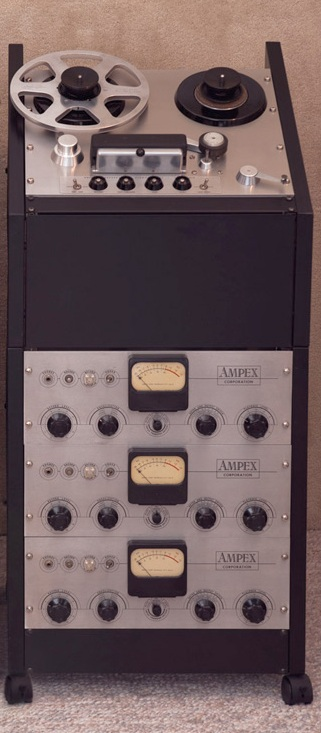

+++
title = "Control Men in Technological Transition: Engineering the Performance in the Age of High Fidelity"
outputs = ["Reveal"]
[reveal_hugo]
custom_theme = "reveal-hugo/themes/sunblind.css"
slide_number = true
+++

## Control Men in Technological Transition

### Engineering the Performance in the Age of High Fidelity

{}
**Impact of tape, LP, and stereo on recording studio:**

* **Tape:**
    * More control during recording
    * Ability to manipulate the recording after it was made
* **LP:**
    * Songs no longer limited to four minutes
* **Stereo:**
    * Forced re-conceptualization of spatial arrangement of instruments and voices in the studio and the balance in the recording
    * Increased importance of the recording engineer, who became an artistic collaborator in some cases

Overall, these innovations led to a revolution in recording studio practices and techniques, and a shift in emphasis from the studio to the control room.
{}

---

##  From Disc to Tape

**Limitations of lacquer-coated aluminum disc as recording medium:**

* **Limited playing time:** Lacquer-coated discs typically could hold no more than 5 minutes of music per side.
* **No practical means to correct flaws:** If a mistake was made during recording, the entire performance had to be re-recorded.

{}
Until 1948, professional recording was made directly to wax or lacquer-coated discs

**Limitations of lacquer-coated aluminum disc as recording medium:**

* **Limited playing time:** Lacquer-coated discs typically could hold no more than 5 minutes of music per side.
* **No practical means to correct flaws:** If a mistake was made during recording, the entire performance had to be re-recorded.

These limitations were overcome by the introduction of tape recorders and the long-playing record.

**Additional details from the sources you provided:**

* The quality of lacquer-coated aluminum discs improved during the 1930s, but they were still relatively fragile and prone to scratching.
* During World War II, wartime restrictions necessitated substituting glass for aluminum in lacquer-coated discs. However, glass discs were even more fragile than aluminum discs and were also more difficult to cut.
* The Armed Forces V-Disc program continued to produce records on Vinylite, a new material that was more flexible and durable than shellac. Vinylite would later replace shellac in commercial records.

Overall, the limitations of lacquer-coated aluminum discs as a recording medium made them unsuitable for the demands of the post-World War II recording industry. Tape recorders and the long-playing record offered a number of advantages over lacquer-coated discs, including longer playing time, the ability to edit recordings, and greater durability.
{}

---

<iframe width="560" height="315" src="https://www.youtube.com/embed/AKr0AMbcmRU?si=_zgbBgLUwwFkLfug" title="YouTube video player" frameborder="0" allow="accelerometer; autoplay; clipboard-write; encrypted-media; gyroscope; picture-in-picture; web-share" allowfullscreen></iframe>

{}
**Problems with early magnetic tape recorders:**

* **Noisy:** Early magnetic tape recorders were very noisy, making them difficult to use for broadcast applications.
* **Poor sound quality:** The sound quality of early magnetic tape recorders was not as good as that of existing disc recording equipment.

These problems were due to a number of factors, including:

* **Limitations of early magnetic tape:** Early magnetic tape was not as high-quality as modern magnetic tape, and it was more susceptible to noise and distortion.
* **Limitations of early tape recorder technology:** Early tape recorders were not as well-designed or manufactured as modern tape recorders.

Despite these problems, audio engineers recognized the potential of magnetic tape recording and reproducing systems because of the ability to edit, erase, and reuse tape. This potential led to significant research and development work on both tape and tape recorders in the years following World War II.
{}

---

## Ampex Model 200A 

<iframe width="560" height="315" src="https://www.youtube.com/embed/olg5OMBil84?si=KSOJG-uj4uHWHzEP&amp;start=2597" title="YouTube video player" frameborder="0" allow="accelerometer; autoplay; clipboard-write; encrypted-media; gyroscope; picture-in-picture; web-share" allowfullscreen></iframe>

{}
**Ampex Model 200 tape recorder:**

* First studio quality tape recorder in the United States
* Quickly embraced by the entertainment industry
* Used to record the first radio program taped for later broadcast (Bing Crosby Show)
* Known for its rugged reliability, sound quality, and ease of editing
{}

---

## Limitations of Ampex

* Tape print-through
* Tape transport speed
* Excessive wear on recording heads

{}
**Limitations of early Ampex tape recorders:**

* Tape print-through: The signal from one layer of tape could transfer to the adjacent layer of tape on the reel.
* Tape transport speed: The initial tape transport speed of 30 inches per second resulted in high sound quality but only about 15 minutes of recording time per reel of tape.
* Excessive wear on recording heads: Editing involved considerable movement of the tape back and forth across the recording heads, which caused excessive wear on the heads and resulted in loss of fidelity.

**Other limitations:**

* Record companies were initially unwilling to rely on tape as the primary recording medium, as it was an unproven technology.
* Tape was expensive, and tape recorders were complex and expensive to operate.

Despite these limitations, the Ampex Model 200 tape recorder was a revolutionary device that changed the way audio was recorded and edited. It had a profound impact on the recording industry and on popular music as a whole.
{}

---

{}

Ampex produced the improved Model 300, a smaller, less costly version of the Model 200 with improved head design and tape quality, and operating speed of fifteen inches per second. This recorder, along with the subsequent Model 350, became the preferred studio recorders for years to come.18 **By 1950, every major recording studio had converted to tape as its primary recording medium**

**Effect on performers, composers, engineers, and producers:**

* Allowed for longer, more complex compositions
* Allowed for greater experimentation and innovation
* Increased the importance of the engineer and producer

{}

---

##  Record Length, Time Limitations, and the LP

* Short playing time 
* Annoying breaks between and often within a movement of a symphonic work 
* Frustration for musicians 

{}
**Limitations of the 78 rpm record:**

* **Short playing time:** 78 rpm records could only hold approximately three minutes of music per side.
* **Annoying breaks between and often within a movement of a symphonic work:** Symphonic works had to be recorded on multiple discs and released as multi-disc albums, with breaks between and often within a movement.
* **Frustration for musicians:** The time restrictions on 78 rpm records could cause frustration for musicians, especially when recording complex pieces of music.

**Examples of how musicians were impacted by the time restrictions on 78 rpm records:**

* Producer Teddy Reig recalled that time was the most important consideration in making 78s, and that he would experience "cardiac arrest during the last fifteen seconds" of a recording session.
* Frank Sinatra refused to speed up the tempo of his recording of "Body and Soul" to remain within the desired three minutes, insisting that any change of tempo would "kill the feeling."
* Rosa Ponselle declared she would have taken more liberties to express emotion in her performance without the cuts necessary to stay within the time restriction.

The introduction of the LP record in 1948 revolutionized the music industry by eliminating the time restrictions of the 78 rpm record. This allowed musicians to record longer, more complex pieces of music, and gave them more creative freedom.
{}

---

## 78 and Jazz Musicians

<iframe width="560" height="315" src="https://www.youtube.com/embed/6SSUnWByZJw?si=LvPAgudYxeSZq3FS" title="YouTube video player" frameborder="0" allow="accelerometer; autoplay; clipboard-write; encrypted-media; gyroscope; picture-in-picture; web-share" allowfullscreen></iframe>

{}
**Summary of the impact of the 78 rpm record on jazz musicians:**

* The three-minute time restriction of 78 rpm records was a major impediment to creative expression for jazz musicians, who often wanted to improvise and "stretch out" in their solos.
* Milt Gabler, the owner of Commodore Records, was one of the first record producers to offer jazz musicians more playing time by recording them on 12-inch discs. This allowed musicians to improvise more freely and to record longer, more complex pieces of music.
* Gabler's recordings helped to popularize the idea of improvisation in jazz and paved the way for the development of the long-playing record, which would revolutionize the music industry in the years to come.

**Examples of how jazz musicians were impacted by the time restrictions of the 78 rpm record:**

* Bix Beiderbecke hated the three-minute time restrictions of early 10-inch 78 rpm records because there was no room for improvisation.
* The Commodore recordings gave jazz musicians room to improvise and to record unwritten songs that evolved from musical ideas sketched in on the spot.
* The Decca recording of "A Good Man Is Hard to Find" was a seventeen-minute version of the song spread over four sides, which was a significant step towards the development of the long-playing record.

The introduction of the long-playing record in 1948 was a major breakthrough for jazz musicians, as it allowed them to record longer, more complex pieces of music and gave them more creative freedom. This led to a golden age of jazz in the 1950s and 1960s, as musicians were able to fully express themselves on record for the first time.
{}

---

## Development of the LP

<iframe width="560" height="315" src="https://www.youtube.com/embed/kymEcF2dxKk?si=ejhYswMqoByRSSoj" title="YouTube video player" frameborder="0" allow="accelerometer; autoplay; clipboard-write; encrypted-media; gyroscope; picture-in-picture; web-share" allowfullscreen></iframe>

{}
**Summary of the development of the LP record:**

* RCA Victor released a long-playing record in 1932, but it was unsuccessful due to its poor quality.
* Fifteen years later, Columbia Records developed a successful LP record under the leadership of William Bachman.
* The key technical components of the LP record were microgroove cutting and a heated stylus.
* The commercial success of the LP record was due to a combination of factors, including wide distribution, the availability of an affordable player, and the second American Federation of Musicians' recording ban.

**The impact of the AFM recording ban on the development of the LP record:**

* The second AFM recording ban in 1948 gave record companies an incentive to develop the LP record, as it would allow them to release more music without having to pay musicians as often.
* The ban also led to a surge in demand for recordings, which helped to drive the popularity of the LP record.

**The role of Mary Howard in the development of the LP record:**

* Mary Howard was one of the few women recordists in the industry.
* She played a key role in developing the LP record by recording air checks for transcription companies in the days leading up to the AFM recording ban.

The introduction of the LP record in 1948 was a major breakthrough in the music industry. It allowed artists to record longer, more complex pieces of music and gave them more creative freedom. It also made music more accessible to consumers, as LP records were less expensive than 78 rpm records. The LP record revolutionized the way music is recorded, listened to, and enjoyed.
{}

---

## Microgroove LP Record (1948)

<iframe width="560" height="315" src="https://www.youtube.com/embed/BuyNKiLeu54?si=SvMTG0YnmAVoI5X7" title="YouTube video player" frameborder="0" allow="accelerometer; autoplay; clipboard-write; encrypted-media; gyroscope; picture-in-picture; web-share" allowfullscreen></iframe>

{}
Bullet points summarizing the benefits of the microgroove LP record:

* **Longer playing time:** Up to nearly 45 minutes per side, allowing an entire symphony to be available on one record.
* **Nonbreakable and virtually free of needle scratch:** Made from Vinylite, a lighter and more flexible material than shellac.
* **Increased fidelity:** Set a new standard in listening.
* **Allowed jazz musicians to improvise:** Eliminated the need to speed up or cut songs.
* **Thematic concept:** Albums were linked by a concept or theme, rather than simply being a collection of songs.

Impact on the music industry:

* **Allowed for new and innovative ways to record and release music:** Artists could now record longer, more complex pieces of music, and they had more creative freedom.
* **Led to the rise of new genres of music:** The increased creative freedom offered by the LP record led to the rise of new genres of music, such as rock and roll and jazz.
* **Made music more accessible to consumers:** The LP record was less expensive than 78 rpm records, making music more accessible to the public.

The introduction of the microgroove LP record in 1948 was a major breakthrough in the music industry. It had a profound impact on the way music is recorded, listened to, and enjoyed.
{}

---

**Summary of the key technological innovations that led to the development of high-fidelity records:**

* **Magnetic tape:** Magnetic tape could record a wider range of frequencies (30-15,000 cycles per second) than disc recording (50-8,000 cycles per second). This allowed for greater clarity and depth in the sound of recorded music.
* **Vinylite discs:** Vinylite discs were a lighter and more flexible material than shellac, which made them less likely to break and reduced needle scratch.
* **Improved home reproduction equipment:** Improved home reproduction equipment, such as turntables and amplifiers, were able to reproduce the wider range of frequencies captured on magnetic tape and Vinylite discs.

{}
**Summary of the key technological innovations that led to the development of high-fidelity records:**

* **Magnetic tape:** Magnetic tape could record a wider range of frequencies (30-15,000 cycles per second) than disc recording (50-8,000 cycles per second). This allowed for greater clarity and depth in the sound of recorded music.
* **Vinylite discs:** Vinylite discs were a lighter and more flexible material than shellac, which made them less likely to break and reduced needle scratch.
* **Improved home reproduction equipment:** Improved home reproduction equipment, such as turntables and amplifiers, were able to reproduce the wider range of frequencies captured on magnetic tape and Vinylite discs.

**Other improvements necessary to achieve high-fidelity sound:**

* **Electroplating:** Improvements in the electroplating process were necessary to ensure that the grooves on the record were accurately copied from the lacquer master.
* **Chemical compounds:** Improvements in the chemical compounds used to manufacture the records were necessary to reduce surface noise.
* **Tooling and materials:** Improvements in the tooling and materials used to manufacture the records were necessary to ensure that they were of high quality.
* **Cutting apparatus:** Improvements in the cutting apparatus were necessary to ensure that the lacquer master was cut with minimal noise or loss of signal.
* **Heated stylus:** The use of a heated stylus helped to reduce surface noise by creating a smooth surface on the groove wall.

The introduction of these technological innovations in the late 1940s and early 1950s ushered in a new era of high-fidelity records. High-fidelity records allowed consumers to experience music in a way that was never before possible. The sound was clearer, deeper, and more realistic. This had a profound impact on the way music was recorded, listened to, and enjoyed.
{}

---

##  Microphoning

---

##  Recording Consoles and Black Boxes: The Control Man’s Instruments
---

##  Stereo, the End of the 78, and the Coming of Multi-track
---

##  Engineering the Performance: Tacit Knowledge and the Art of Controlling Sound
---

##  The Studio Working Environment: Teamwork and Collaboration in the Trading Zone

---
