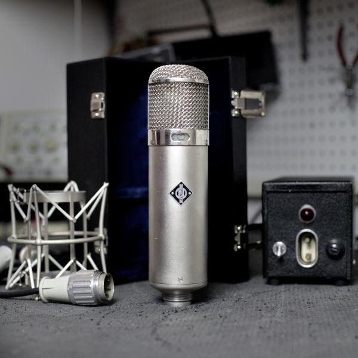

+++
title = "Control Men in Technological Transition: Engineering the Performance in the Age of High Fidelity"
outputs = ["Reveal"]
[reveal_hugo]
custom_theme = "reveal-hugo/themes/sunblind.css"
slide_number = true
+++

## Control Men in Technological Transition

### Engineering the Performance in the Age of High Fidelity

{}
**Impact of tape, LP, and stereo on recording studio:**

* **Tape:**
    * More control during recording
    * Ability to manipulate the recording after it was made
* **LP:**
    * Songs no longer limited to four minutes
* **Stereo:**
    * Forced re-conceptualization of spatial arrangement of instruments and voices in the studio and the balance in the recording
    * Increased importance of the recording engineer, who became an artistic collaborator in some cases

Overall, these innovations led to a revolution in recording studio practices and techniques, and a shift in emphasis from the studio to the control room.
{}

---

##  From Disc to Tape

**Limitations of lacquer-coated aluminum disc as recording medium:**

* **Limited playing time:** Lacquer-coated discs typically could hold no more than 5 minutes of music per side.
* **No practical means to correct flaws:** If a mistake was made during recording, the entire performance had to be re-recorded.

{}
Until 1948, professional recording was made directly to wax or lacquer-coated discs

**Limitations of lacquer-coated aluminum disc as recording medium:**

* **Limited playing time:** Lacquer-coated discs typically could hold no more than 5 minutes of music per side.
* **No practical means to correct flaws:** If a mistake was made during recording, the entire performance had to be re-recorded.

These limitations were overcome by the introduction of tape recorders and the long-playing record.

**Additional details from the sources you provided:**

* The quality of lacquer-coated aluminum discs improved during the 1930s, but they were still relatively fragile and prone to scratching.
* During World War II, wartime restrictions necessitated substituting glass for aluminum in lacquer-coated discs. However, glass discs were even more fragile than aluminum discs and were also more difficult to cut.
* The Armed Forces V-Disc program continued to produce records on Vinylite, a new material that was more flexible and durable than shellac. Vinylite would later replace shellac in commercial records.

Overall, the limitations of lacquer-coated aluminum discs as a recording medium made them unsuitable for the demands of the post-World War II recording industry. Tape recorders and the long-playing record offered a number of advantages over lacquer-coated discs, including longer playing time, the ability to edit recordings, and greater durability.
{}

---

<iframe width="560" height="315" src="https://www.youtube.com/embed/AKr0AMbcmRU?si=_zgbBgLUwwFkLfug" title="YouTube video player" frameborder="0" allow="accelerometer; autoplay; clipboard-write; encrypted-media; gyroscope; picture-in-picture; web-share" allowfullscreen></iframe>

{}
**Problems with early magnetic tape recorders:**

* **Noisy:** Early magnetic tape recorders were very noisy, making them difficult to use for broadcast applications.
* **Poor sound quality:** The sound quality of early magnetic tape recorders was not as good as that of existing disc recording equipment.

These problems were due to a number of factors, including:

* **Limitations of early magnetic tape:** Early magnetic tape was not as high-quality as modern magnetic tape, and it was more susceptible to noise and distortion.
* **Limitations of early tape recorder technology:** Early tape recorders were not as well-designed or manufactured as modern tape recorders.

Despite these problems, audio engineers recognized the potential of magnetic tape recording and reproducing systems because of the ability to edit, erase, and reuse tape. This potential led to significant research and development work on both tape and tape recorders in the years following World War II.
{}

---

## Ampex Model 200A 

<iframe width="560" height="315" src="https://www.youtube.com/embed/olg5OMBil84?si=KSOJG-uj4uHWHzEP&amp;start=2597" title="YouTube video player" frameborder="0" allow="accelerometer; autoplay; clipboard-write; encrypted-media; gyroscope; picture-in-picture; web-share" allowfullscreen></iframe>

{}
**Ampex Model 200 tape recorder:**

* First studio quality tape recorder in the United States
* Quickly embraced by the entertainment industry
* Used to record the first radio program taped for later broadcast (Bing Crosby Show)
* Known for its rugged reliability, sound quality, and ease of editing
{}

---

## Limitations of Ampex

* Tape print-through
* Tape transport speed
* Excessive wear on recording heads

{}
**Limitations of early Ampex tape recorders:**

* Tape print-through: The signal from one layer of tape could transfer to the adjacent layer of tape on the reel.
* Tape transport speed: The initial tape transport speed of 30 inches per second resulted in high sound quality but only about 15 minutes of recording time per reel of tape.
* Excessive wear on recording heads: Editing involved considerable movement of the tape back and forth across the recording heads, which caused excessive wear on the heads and resulted in loss of fidelity.

**Other limitations:**

* Record companies were initially unwilling to rely on tape as the primary recording medium, as it was an unproven technology.
* Tape was expensive, and tape recorders were complex and expensive to operate.

Despite these limitations, the Ampex Model 200 tape recorder was a revolutionary device that changed the way audio was recorded and edited. It had a profound impact on the recording industry and on popular music as a whole.
{}

---

{}

Ampex produced the improved Model 300, a smaller, less costly version of the Model 200 with improved head design and tape quality, and operating speed of fifteen inches per second. This recorder, along with the subsequent Model 350, became the preferred studio recorders for years to come.18 **By 1950, every major recording studio had converted to tape as its primary recording medium**

**Effect on performers, composers, engineers, and producers:**

* Allowed for longer, more complex compositions
* Allowed for greater experimentation and innovation
* Increased the importance of the engineer and producer

{}

---

##  Record Length, Time Limitations, and the LP

* Short playing time 
* Annoying breaks between and often within a movement of a symphonic work 
* Frustration for musicians 

{}
**Limitations of the 78 rpm record:**

* **Short playing time:** 78 rpm records could only hold approximately three minutes of music per side.
* **Annoying breaks between and often within a movement of a symphonic work:** Symphonic works had to be recorded on multiple discs and released as multi-disc albums, with breaks between and often within a movement.
* **Frustration for musicians:** The time restrictions on 78 rpm records could cause frustration for musicians, especially when recording complex pieces of music.

**Examples of how musicians were impacted by the time restrictions on 78 rpm records:**

* Producer Teddy Reig recalled that time was the most important consideration in making 78s, and that he would experience "cardiac arrest during the last fifteen seconds" of a recording session.
* Frank Sinatra refused to speed up the tempo of his recording of "Body and Soul" to remain within the desired three minutes, insisting that any change of tempo would "kill the feeling."
* Rosa Ponselle declared she would have taken more liberties to express emotion in her performance without the cuts necessary to stay within the time restriction.

The introduction of the LP record in 1948 revolutionized the music industry by eliminating the time restrictions of the 78 rpm record. This allowed musicians to record longer, more complex pieces of music, and gave them more creative freedom.
{}

---

## 78 and Jazz Musicians

<iframe width="560" height="315" src="https://www.youtube.com/embed/6SSUnWByZJw?si=LvPAgudYxeSZq3FS" title="YouTube video player" frameborder="0" allow="accelerometer; autoplay; clipboard-write; encrypted-media; gyroscope; picture-in-picture; web-share" allowfullscreen></iframe>

{}
**Summary of the impact of the 78 rpm record on jazz musicians:**

* The three-minute time restriction of 78 rpm records was a major impediment to creative expression for jazz musicians, who often wanted to improvise and "stretch out" in their solos.
* Milt Gabler, the owner of Commodore Records, was one of the first record producers to offer jazz musicians more playing time by recording them on 12-inch discs. This allowed musicians to improvise more freely and to record longer, more complex pieces of music.
* Gabler's recordings helped to popularize the idea of improvisation in jazz and paved the way for the development of the long-playing record, which would revolutionize the music industry in the years to come.

**Examples of how jazz musicians were impacted by the time restrictions of the 78 rpm record:**

* Bix Beiderbecke hated the three-minute time restrictions of early 10-inch 78 rpm records because there was no room for improvisation.
* The Commodore recordings gave jazz musicians room to improvise and to record unwritten songs that evolved from musical ideas sketched in on the spot.
* The Decca recording of "A Good Man Is Hard to Find" was a seventeen-minute version of the song spread over four sides, which was a significant step towards the development of the long-playing record.

The introduction of the long-playing record in 1948 was a major breakthrough for jazz musicians, as it allowed them to record longer, more complex pieces of music and gave them more creative freedom. This led to a golden age of jazz in the 1950s and 1960s, as musicians were able to fully express themselves on record for the first time.
{}

---

## Development of the LP

<iframe width="560" height="315" src="https://www.youtube.com/embed/kymEcF2dxKk?si=ejhYswMqoByRSSoj" title="YouTube video player" frameborder="0" allow="accelerometer; autoplay; clipboard-write; encrypted-media; gyroscope; picture-in-picture; web-share" allowfullscreen></iframe>

{}
**Summary of the development of the LP record:**

* RCA Victor released a long-playing record in 1932, but it was unsuccessful due to its poor quality.
* Fifteen years later, Columbia Records developed a successful LP record under the leadership of William Bachman.
* The key technical components of the LP record were microgroove cutting and a heated stylus.
* The commercial success of the LP record was due to a combination of factors, including wide distribution, the availability of an affordable player, and the second American Federation of Musicians' recording ban.

**The impact of the AFM recording ban on the development of the LP record:**

* The second AFM recording ban in 1948 gave record companies an incentive to develop the LP record, as it would allow them to release more music without having to pay musicians as often.
* The ban also led to a surge in demand for recordings, which helped to drive the popularity of the LP record.

**The role of Mary Howard in the development of the LP record:**

* Mary Howard was one of the few women recordists in the industry.
* She played a key role in developing the LP record by recording air checks for transcription companies in the days leading up to the AFM recording ban.

The introduction of the LP record in 1948 was a major breakthrough in the music industry. It allowed artists to record longer, more complex pieces of music and gave them more creative freedom. It also made music more accessible to consumers, as LP records were less expensive than 78 rpm records. The LP record revolutionized the way music is recorded, listened to, and enjoyed.
{}

---

## Microgroove LP Record (1948)

<iframe width="560" height="315" src="https://www.youtube.com/embed/BuyNKiLeu54?si=SvMTG0YnmAVoI5X7" title="YouTube video player" frameborder="0" allow="accelerometer; autoplay; clipboard-write; encrypted-media; gyroscope; picture-in-picture; web-share" allowfullscreen></iframe>

{}
Bullet points summarizing the benefits of the microgroove LP record:

* **Longer playing time:** Up to nearly 45 minutes per side, allowing an entire symphony to be available on one record.
* **Nonbreakable and virtually free of needle scratch:** Made from Vinylite, a lighter and more flexible material than shellac.
* **Increased fidelity:** Set a new standard in listening.
* **Allowed jazz musicians to improvise:** Eliminated the need to speed up or cut songs.
* **Thematic concept:** Albums were linked by a concept or theme, rather than simply being a collection of songs.

Impact on the music industry:

* **Allowed for new and innovative ways to record and release music:** Artists could now record longer, more complex pieces of music, and they had more creative freedom.
* **Led to the rise of new genres of music:** The increased creative freedom offered by the LP record led to the rise of new genres of music, such as rock and roll and jazz.
* **Made music more accessible to consumers:** The LP record was less expensive than 78 rpm records, making music more accessible to the public.

The introduction of the microgroove LP record in 1948 was a major breakthrough in the music industry. It had a profound impact on the way music is recorded, listened to, and enjoyed.
{}

---

**Summary of the key technological innovations that led to the development of high-fidelity records:**

* **Magnetic tape:** Magnetic tape could record a wider range of frequencies (30-15,000 cycles per second) than disc recording (50-8,000 cycles per second). This allowed for greater clarity and depth in the sound of recorded music.
* **Vinylite discs:** Vinylite discs were a lighter and more flexible material than shellac, which made them less likely to break and reduced needle scratch.
* **Improved home reproduction equipment:** Improved home reproduction equipment, such as turntables and amplifiers, were able to reproduce the wider range of frequencies captured on magnetic tape and Vinylite discs.

{}
**Summary of the key technological innovations that led to the development of high-fidelity records:**

* **Magnetic tape:** Magnetic tape could record a wider range of frequencies (30-15,000 cycles per second) than disc recording (50-8,000 cycles per second). This allowed for greater clarity and depth in the sound of recorded music.
* **Vinylite discs:** Vinylite discs were a lighter and more flexible material than shellac, which made them less likely to break and reduced needle scratch.
* **Improved home reproduction equipment:** Improved home reproduction equipment, such as turntables and amplifiers, were able to reproduce the wider range of frequencies captured on magnetic tape and Vinylite discs.

**Other improvements necessary to achieve high-fidelity sound:**

* **Electroplating:** Improvements in the electroplating process were necessary to ensure that the grooves on the record were accurately copied from the lacquer master.
* **Chemical compounds:** Improvements in the chemical compounds used to manufacture the records were necessary to reduce surface noise.
* **Tooling and materials:** Improvements in the tooling and materials used to manufacture the records were necessary to ensure that they were of high quality.
* **Cutting apparatus:** Improvements in the cutting apparatus were necessary to ensure that the lacquer master was cut with minimal noise or loss of signal.
* **Heated stylus:** The use of a heated stylus helped to reduce surface noise by creating a smooth surface on the groove wall.

The introduction of these technological innovations in the late 1940s and early 1950s ushered in a new era of high-fidelity records. High-fidelity records allowed consumers to experience music in a way that was never before possible. The sound was clearer, deeper, and more realistic. This had a profound impact on the way music was recorded, listened to, and enjoyed.
{}

---

##  Microphoning

{}
- Recording engineers in the 1950s had a wide range of instruments at their disposal, including microphones, mixing consoles, amplifiers, pre-amplifiers, equalizers, compressors, limiters, tape recorders, cutting styli, lathes, blank discs, cables, vacuum tubes, and loudspeakers.
- These instruments allowed them to capture and manipulate sound in ways that were not possible before.
- One of the most important aspects of recording in the 1950s was the selection and placement of microphones.
- Engineers experimented with different types of microphones and placements to achieve the desired sound.
- This became an art form, and it played a major role in shaping the sound of the music of the era.
{}

---

## Microphones 

* **Condenser microphones** were the first to be used in electrical recording, but they were expensive and complex.
* **Dynamic microphones** were introduced later and were more affordable and durable, making them more popular for recording.
* **Ribbon microphones** offered a unique sound that was popular with many recording engineers.
* In the 1950s, the **Neumann U47** condenser microphone was developed, which offered the best sound quality and flexibility of any microphone available at the time.

{}

**Condenser microphones**
* The first microphones to accompany the electrical recording system in the 1920s
* More expensive and complex than dynamic microphones, but offered superior sound quality

**Dynamic microphones**
* Introduced by Western Electric in the late 1920s
* Simple and durable, making them ideal for many applications of disc recording
* The most popular microphones for recording in the 1930s and 1940s

**Ribbon microphones**
* Introduced by RCA in the 1930s
* Offered a unique sound that was popular with many recording engineers

**Neumann U47 condenser microphone**
* Developed in 1947
* Offered a wider dynamic and frequency range than any other previous microphone
* Became the vocal microphone of choice for Frank Sinatra, among others
* Made single-mike recording of symphonic music possible

Overall, the types of microphones used in recording history have evolved over time, with each new type offering its own unique advantages.
{}

---

{}
**Clair Krepps**
* An engineer who set up Capitol Records’ first New York studio
* Among the first recording engineers in the United States to use the Telefunken mike

**Peggy Lee and the Stan Kenton band**
* Krepps used the Telefunken mike to record Peggy Lee's vocals with the Stan Kenton band
* He believed the mike would provide support for Lee's relatively soft voice

**Neumann U47 microphone**
* A directional microphone that can be adjusted
* Ideal for orchestral as well as close-miking of either voices or instruments

{}

---

## Neumann U 47

* Large-diaphragm condenser microphone with a warm and musical sound
* Wide frequency response for accurate reproduction of a wide range of frequencies
* Excellent transient response for capturing the quick attacks and releases of sound waves
* Versatile microphone that can be used to record a variety of instruments and vocals in a variety of recording environments

> [Tube Mic Shootout - Acoustic Guitar | recording hacks](http://recordinghacks.com/2010/06/09/acoustic-guitar-tube-mic-shootout/)

{}
The Neumann U 47: https://en.wikipedia.org/wiki/Neumann_U_47 is a large-diaphragm condenser microphone that was manufactured by Georg Neumann GmbH during the years 1949-1965. It is considered to be one of the best microphones ever made, and it is still used by recording engineers today.

The U 47 is a tube microphone, which means that it uses a vacuum tube to amplify the signal. Vacuum tubes are known for their warm and musical sound, which is why many recording engineers prefer to use tube microphones.

The U 47 has a wide frequency response, which means that it can accurately reproduce a wide range of frequencies. This makes it ideal for recording a variety of instruments and vocals.

The U 47 is also known for its excellent transient response. This means that it can accurately capture the quick attacks and releases of sound waves. This is important for recording instruments such as drums and guitars, which have a lot of transients.

The U 47 is a very versatile microphone. It can be used to record a variety of instruments and vocals, and it can be used in a variety of recording environments. It is a popular choice for recording studios, but it is also used by live sound engineers and podcasters.

Here are some of the features that make the Neumann U 47 such a popular microphone:

* Large-diaphragm condenser microphone with a warm and musical sound
* Wide frequency response for accurate reproduction of a wide range of frequencies
* Excellent transient response for capturing the quick attacks and releases of sound waves
* Versatile microphone that can be used to record a variety of instruments and vocals in a variety of recording environments

The Neumann U 47 is a classic microphone that is still used by recording engineers today. It is a great choice for anyone who is looking for a high-quality microphone that can produce excellent results.

{}

---

<iframe width="560" height="315" src="https://www.youtube.com/embed/0T9hPWTZr6s?si=VKU3q5vvAueZuw7j" title="YouTube video player" frameborder="0" allow="accelerometer; autoplay; clipboard-write; encrypted-media; gyroscope; picture-in-picture; web-share" allowfullscreen></iframe>

---

## Mercury Living Presence Series - U47

<iframe width="560" height="315" src="https://www.youtube.com/embed/Xz296L9PJXg?si=wJhA3ojJqFUg962w" title="YouTube video player" frameborder="0" allow="accelerometer; autoplay; clipboard-write; encrypted-media; gyroscope; picture-in-picture; web-share" allowfullscreen></iframe>

{}
**Mercury Living Presence Series**
* The first record in the series was released in 1951
* Engineer Bob Fine used a single U47 microphone to capture the performance and the natural ambience of the room

**Conclusion**
Clair Krepps and Bob Fine were two of the first recording engineers to use the Neumann U47 microphone. Their use of this microphone revolutionized classical recording by allowing them to capture the sound of the orchestra and the ambience of the hall in a more natural way.
{}

---

## Equalization

{}
* Early equalizers were noisy and made audible clicks when adjusted.
* They also caused a full twenty-four decibel loss, which required the use of another amplifier to correct.
* Oliver Summerlin and Gene Shenk, two New Jersey audio engineers, developed the first quality equalizer for recording, the Pultec.
* The Pultec is still a highly valued piece of vintage gear today.
* Summerlin and Shenk designed the Pultec to be undetectable when used.

The Pultec EQP-1A3 Equalizer is a two-band passive equalizer that was first released in the 1950s. It is known for its warm and musical sound, and it is still used by many recording engineers today.

Here are the features of the Pultec EQP-1A3 equalizer in bullet points:

* Two-band passive equalizer
* Low shelf band from 200 Hz to 1 kHz
* High shelf band from 2 kHz to 20 kHz
* Separate boost and cut controls for each band
* Bandwidth control for each band
* Warm, punchy, and musical sound
* Versatile equalizer that can be used on a variety of instruments and vocals

{}

---

## Pultec Demo

<iframe width="560" height="315" src="https://www.youtube.com/embed/U3bhyfBt-DE?si=fZD9HYVRkGDKgHtV" title="YouTube video player" frameborder="0" allow="accelerometer; autoplay; clipboard-write; encrypted-media; gyroscope; picture-in-picture; web-share" allowfullscreen></iframe>

---

<iframe width="560" height="315" src="https://www.youtube.com/embed/bum-aMRFGSw?si=RJ2ALUiT3CerpL2Q" title="YouTube video player" frameborder="0" allow="accelerometer; autoplay; clipboard-write; encrypted-media; gyroscope; picture-in-picture; web-share" allowfullscreen></iframe>

{}
* Many engineers used microphone technique instead of relying on equalizers.
* Al Schmitt learned microphone technique early in his career because **Apex Recording**, the studio where he worked, had only one equalizer.
* Schmitt learned to get the sounds he wanted by microphone choice.
* Ribbon microphones were more forgiving of imperfections in a vocal performance.
* To rely on microphone choice and to avoid equalization altogether, an engineer needed to know their microphones and where to place them.
{}

---

## Microphone technique 

<iframe width="560" height="315" src="https://www.youtube.com/embed/ng3XJnC8IN8?si=n5zjSFh7ykniZYoJ" title="YouTube video player" frameborder="0" allow="accelerometer; autoplay; clipboard-write; encrypted-media; gyroscope; picture-in-picture; web-share" allowfullscreen></iframe>

{}
**Summary of the section with bullet points:**

* Microphone choice and placement are critical factors in recording.
* The singers' microphone technique also helps.
* Singers regulate their relative volume by leaning in to the mike on low or soft notes and backing off a bit on the high or loud notes.
* Frank Sinatra is widely regarded as the first to master microphone technique.
* Sinatra used the microphone to create a sense of intimacy and drama in his recordings.

**Good example to listen to:**

Frank Sinatra - "Some Enchanted Evening"

This song is a good example of Sinatra's mastery of microphone technique. He uses a soft, intimate tone on the low notes and then builds to a more powerful delivery on the high notes. He also uses a variety of dynamics and inflections to create a sense of drama and emotion.

{}

---

{}
**Difficulties with recording Sintra**

* The wider range of good microphones gave engineers greater flexibility, but also posed difficulties in balancing an array of instruments and voices.
* Recording brass and strings was a challenge without the use of baffles (gobos) to isolate the instruments from one another.
* Frank Sinatra did not want to be isolated in a vocal booth and insisted on recording live with the band.
* This left engineers little control over the relative volume of his voice.
* The challenge for engineers was to capture and balance all the instruments, including Sinatra's voice, so that the overall mix worked.
* They positioned Sinatra on the floor in front of the stage where the musicians performed to elevate the instruments enough to prevent their direct sound from leaking into the vocal microphone and thus overwhelming Sinatra's voice.
* This "very simple splay" only partially worked because it did not keep the sound of the orchestra completely out of the vocal mike, and because arranger Nelson Riddle used a lot of strings and a lot of brass, it was a constant fight to make all those things come out.
* RCA engineer Ray Hall agreed that the most difficult challenge was recording brass and violins at the same time, because the brass would overpower the violin mikes.
* Because of the time constraints on the sessions, they did the best they could by using baffles, but eliciting the cooperation of the musicians in how they played and where they stood was important.

{}

---

##  Recording Consoles and Black Boxes: The Control Man’s Instruments

{}

* Early control panels were vertical racks with volume controls and meters, built by Western Electric.
* By 1930s, studios used broadcast consoles with sloping desk and upright back panel for meters and controls.Companies like Western Electric, Raytheon, Gates, and RCA manufactured these consoles for radio use, and recording studios adopted the technology.
* Unlike the early Western Electric racks designed for standing operation, the broadcast consoles were desk height so engineers could sit while working.
{}

---

## Langevin Console

[Langevin Tube Console](https://www.historyofrecording.com/Langevin_Tube_Console.html)

{}
* The engineering departments at Columbia and RCA Victor custom-built recording consoles for their studios into the 1950s. Independent manufacturers like Langevin didn't start producing consoles specifically for recording studios until around that time.
* Langevin incorporated improved volume control mechanisms into their consoles. This demonstrates how a small change like the design of the volume control could have a much bigger effect on the engineer's work.
* The most used volume control was the German-made Daven fader. Engineers found these stiff and awful to use - they were meant for submarine commanders, not audio mixers. Langevin and Cinema Engineering introduced smoother rotary slide-wire faders that felt better to use.
{}

---

**Audio Console Design Notes**

<iframe src="audio-console.pdf" width=75% height=750></iframe>

{}

* Article discusses design of consoles for commercial recording studios, looking at several mixing consoles and an editing console.
* Fig. 1 shows a functional console in use in a busy studio, with sloped panel, compact jack field, and pushbuttons for echo and playback.  Olmsted Sound Studios, Inc.
* Fig. 2 details the center panel - 6 mic inputs, 2 high level inputs, pushbuttons to select playback sources that feed the 2 high level inputs.
* Fig. 3 is the block diagram showing the signal flow through the console.
* Console allows easy selection of mics and playback sources to route to echo or sound effects using pushbuttons.
* Fig. 4 shows the interior with vertical amplifiers and horizontal mixing/branching networks. Compact layout but accessible.
* Fig. 5 shows console for larger studio - more vertical mic mixer layout. Has transfer keys to route each channel to main or submixer. Coastal Recording Corporation
* Fig. 6 is partial block diagram of Fig. 5 console - shows mic channels can be routed to main or submixer networks.
* Individual channel equalization allows tailoring each mic's frequency response to correct room acoustics.
* Fig. 7 shows more advanced console with selectors, limiters, and level matching facilities using transformers.
* Fig. 8 shows compact editing/dubbing console with recorders and rack equipment within reach.  Olmsted Sound Studios, Inc.
* Fig. 9 is block diagram of editing console - simple gating of playback sources to recorder or monitor/cue circuits.

{}

---

**Tom Dowd**

{}
* In 1956, Tom Dowd built his own console at Atlantic Records by recycling available materials. He didn't like commercial console designs that put the heat-generating tubes and amplifiers right by the engineer's knees.
* Dowd reconfigured the layout to put all the electronics behind the engineer and used an old studio door for the console surface. This DIY approach was common among independent engineers seeking better designs.
* Consoles changed in ways that made operations easier for engineers, like grouping instruments logically and using slide-wire faders that enabled nuanced mixing by fingertip control.
{}
  
---

<iframe src="https://player.vimeo.com/video/367465076?h=5b4794a46a" width="640" height="360" frameborder="0" allow="autoplay; fullscreen; picture-in-picture" allowfullscreen></iframe>

<a href="https://vimeo.com/367465076">TOM DOWD &amp; THE LANGUAGE OF MUSIC Trailer In HD</a> from <a href="https://vimeo.com/moormannfilms">Mark Moormann</a> on <a href="https://vimeo.com">Vimeo</a>.

{}
Tom Dowd was a pioneering recording engineer and producer who had a long and influential career in the music industry. Some key facts about him:

- Started as a recording engineer at Atlantic Records in the 1950s, later became a producer.
- Worked closely with Atlantic founders Ahmet Ertegun and Jerry Wexler on many classic jazz, R&B, and rock albums.
- Engineered and produced records for Ray Charles, John Coltrane, Ornette Coleman, Aretha Franklin, Otis Redding, Cream, Lynyrd Skynyrd and many other renowned artists.
- Was known for his innovative use of multi-track recording and creative production techniques.
  - As early as 1952, Atlantic Records engineer Tom Dowd was recording sessions in both mono and 2-track stereo formats. He used a staggered-head Magnecorder tape machine to capture a 2-track stereo feed alongside the mono recording. 
  - Dowd had the foresight to archive Atlantic's recordings in stereo years before stereo LPs existed, knowing that stereo records and home playback systems would eventually become a reality and Atlantic would have a catalog ready to release in the new format.
- Built his own mixing console for Atlantic's studio using salvaged parts including an old studio door.
- Had a background in music and physics but learned engineering on the job, gaining deep tacit knowledge.
- Was respected for his musicality, creativity and ability to get great performances out of artists in the studio.
- Pioneered the use of stereo recording and multitrack techniques in the 1950s and 60s. 
- Inducted into the Rock and Roll Hall of Fame in 2002 in the Non-Performer category for his technical and production work.
- Remained an active producer into the 2000s, accumulating over 200 gold and platinum records over his career.
{}

---

##  Stereo, the End of the 78, and the Coming of Multi-track

{}
- RCA Victor started conducting experiments with stereo recording sessions in 1954 to determine the potential of the new technology. They wanted to see what stereo could offer both technically and commercially before adopting it.

{}

---

<iframe width="560" height="315" src="https://www.youtube.com/embed/QlagwjphwXA?si=h2aqX9b7C9fmHvjT" title="YouTube video player" frameborder="0" allow="accelerometer; autoplay; clipboard-write; encrypted-media; gyroscope; picture-in-picture; web-share" allowfullscreen></iframe>

{}
The first commercially available stereo recordings were released on reel-to-reel tape in the early 1950s, before the introduction of stereo vinyl records. Some key early milestones in commercial stereo recording history:
* 1952 - Emory Cook released the first commercial stereo reel-to-reel tapes containing binaural recordings he made at the 1952 Chicago Railroad Fair.
{}

---

<iframe width="560" height="315" src="https://www.youtube.com/embed/9y81hCpDt6o?si=Y5tu0ZeAbU63_BmB" title="YouTube video player" frameborder="0" allow="accelerometer; autoplay; clipboard-write; encrypted-media; gyroscope; picture-in-picture; web-share" allowfullscreen></iframe>

{}
- In 1955, studio owner and engineer Bob Fine began making 3-track stereo recordings for the Mercury Living Presence series. He used custom-built Ampex 3-track tape machines to create these early stereo albums.

Here is a summary of the key points about the Mercury Living Presence discography from the PDF:

- Mercury Living Presence was a legendary catalog of classical music recordings started in 1951 by Robert and Wilma Cozart Fine. 
- They used innovative recording techniques with high quality microphones and tape machines to capture realistic and detailed sound.
- The mono recordings from 1951-1955 used a single Schoeps M201 microphone.
- In 1955 they switched to pioneering 3-track stereo using two Neumann KM56 microphones on the sides and an M201 in the center.
- The height of the mics averaged 12 feet above the conductor to capture room ambience.
- They recorded on Ampex 300-3 half-inch tape machines at 15 ips. Some sessions were on 35mm magnetic film for lower noise. 
- Wilma Fine hand-mixed the 3-track tapes down to stereo, feeding the lathe cutter directly for more lifelike LPs.
- By 1967 when the original team departed, there were over 300 Living Presence titles released.
- In the 1990s, Wilma Fine remastered the recordings for CD reissue, using dCS A/D converters and Sony 1630 recorders. 
- She took great care to capture the original three-micstereo image and sound quality.
- New LP and CD reissues were recently released by Universal, cut from Wilma Fine's digital masters since the original tapes are not accessible.
- The recordings are still praised for their realistic sound and interpretation, as well as the repertoire chosen by the producers.
{}

---

[The Westrex System](The_Westrex_Stereo_Disk_System.pdf)

{}
- During the 1950s, a number of record labels issued stereo recordings on reel-to-reel tapes before stereo disc cutting and playback technology was fully developed. The tapes offered early adopters a stereo listening experience.
- Since no viable stereo disc cutting system had been created yet, the labels could only release stereo on tape until the late 1950s when Westrex introduced the first commercial stereo disc cutters.
- In 1958, after extensive testing and discussion, the record industry agreed on a standardized system for stereophonic disc recording through the Recording Industry Association of America (RIAA). 
- The adoption of this uniform stereo recording standard by all the major labels was crucial in enabling compatible stereo LPs that could be played on monophonic record players using one channel.
- By Fall of 1958, Westrex made the first stereo disc cutting machines available to professional studios after the standard was set. Engineer Bill Stoddard recalled Universal Recording in Chicago acquiring one of the first models and retiring their mono lathe.

Here is a summary of the key points about stereo recording from this 1958 paper, along with explanations of the figures:

- The paper introduces the Westrex StereoDisk system for recording two stereophonic channels in a single record groove.
- The two channels are recorded with their axes at 90 degrees to each other, each channel at 45 degrees to the horizontal record surface. 
- This 45-45 orthogonal system provides symmetry between channels and compatibility with monophonic lateral playback.
- Figure 2 in the Westrex StereoDisk System paper shows a simplified illustration of the stereo disk recorder. Some key elements shown:
  - There are two magnetic coil assemblies positioned at 90 degrees to each other. 
  - Each coil assembly contains a drive coil and a feedback coil.
    - The drive coils are connected to drive the stylus through stiff wire linkages.
    - The feedback coils are part of feedback control loops to provide stability. 
    - A single magnet provides equal magnetic flux to both coil assemblies.
    - The stylus is mounted on a tubular cantilever spring that allows motion in any direction.
    - A damper is attached to the stylus mounting to smooth peaks in the monitor output.
    - Copper shields between the coils reduce inductive crosstalk from the drive coils to the feedback coils.

**In summary, Figure 2 illustrates how the two channel stereophonic recorder is constructed using orthogonal magnetic coil assemblies to drive the cutting stylus, with feedback control for each channel.**

- Fig. 5 shows cross-sections of the 45-45 stereo groove for different input conditions - one channel only, two channels in-phase, two channels out-of-phase.
- Figs. 6 and 7 are photomicrographs showing the lateral and vertical groove modulations produced by the 45-45 system.
- The recorder uses electrodynamic feedback with moving coils to cut the complex stereo grooves. Feedback provides stability and linearity.
- The reproducer also uses moving coils at 45 degrees to trace the complex grooves and recover the original stereo signals.
- Figs. 11 and 14 show the mechanical design of the reproducer with orthogonal coils driving the stylus.
- Tracking angle differences between recorder and reproducer introduce distortion, analyzed in Figs. 12 and 13.
- Fig. 15 shows the frequency response of one reproducer channel, indicating good performance to 15 kHz. 
- Figs. 16 and 17 show low harmonic and intermodulation distortion, comparing lateral, vertical and 45 degree recordings.
- Overall the 45-45 system provided high quality stereophonic sound from a single groove compatible with monophonic playback.
{}
