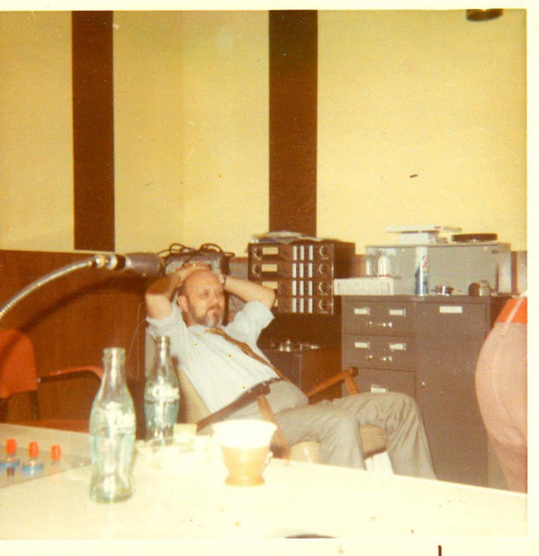

+++
title = "The Search for the Sound: Rhythm and Blues, Rock ’n’ Roll, and the Rise of the Independents"
outputs = ["Reveal"]
[reveal_hugo]
custom_theme = "reveal-hugo/themes/sunblind.css"
slide_number = true
+++

# The Search for the Sound

## Rhythm and Blues, Rock ’n’ Roll, and the Rise of the Independents

{}

- In the 1940s and 1950s, there was a major rise in the number of small independent record labels and recording studios operating outside the major record companies like Columbia, RCA Victor, and Capitol. 
- These independent labels and studios specialized in serving niche music markets for genres like rhythm and blues, country, boogie-woogie, and early rock 'n roll. This music was considered outside the mainstream industry.
{}

---

## Boycotts 

  <iframe width="560" height="315" src="https://www.youtube.com/embed/4WXYjm74WFI?si=OdyLIMZ-HVUtBX2I" title="YouTube video player" frameborder="0" allow="accelerometer; autoplay; clipboard-write; encrypted-media; gyroscope; picture-in-picture; web-share" allowfullscreen></iframe>  
  <iframe width="560" height="315" src="https://www.youtube.com/embed/T_vgfavJ50E?si=nIM-AfDCY8Y_YJH4" title="YouTube video player" frameborder="0" allow="accelerometer; autoplay; clipboard-write; encrypted-media; gyroscope; picture-in-picture; web-share" allowfullscreen></iframe> 

{}
- Two important industry boycotts in the early 1940s helped boost the popularity and distribution of music from independent labels:
   - The 1941 radio boycott of ASCAP-licensed songs gave airplay to BMI-licensed music by artists like Hank Williams and Wynonie Harris instead of hits by Gershwin or Cole Porter.
   - The 1942-44 recording strike opened the market for independent labels willing to sign agreements with musicians' unions when major labels would not.

{}

---

## Independents - King Records

<iframe width="560" height="315" src="https://www.youtube.com/embed/Vzp3hlb1H3A?si=X6mqE3vjxfiCxk-H?t=442" title="YouTube video player" frameborder="0" allow="accelerometer; autoplay; clipboard-write; encrypted-media; gyroscope; picture-in-picture; web-share" allowfullscreen></iframe>
<iframe width="560" height="315" src="https://www.youtube.com/embed/gqkGYhyDkok?si=lQEz1HZojaF_WyYq" title="YouTube video player" frameborder="0" allow="accelerometer; autoplay; clipboard-write; encrypted-media; gyroscope; picture-in-picture; web-share" allowfullscreen></iframe>

{}
- The independent recording studios that proliferated after WWII ranged greatly in their technical capabilities and facilities:
   - Some like Universal in Chicago were highly professional operations rivaling major label studios.
   - Others were makeshift DIY setups in basements, storefronts, or backrooms with equipment cobbled together.
- The increased availability of affordable, quality tape recorders after WWII made high-quality recording more accessible to amateur enthusiasts focused on the music over mastering the technology.
- Independent studio owners provided vital opportunities for aspiring singers, songwriters and musicians to make records and get exposure beyond just their local markets.
- Recording engineers at independent studios often collaborated directly with musicians in ways major labels did not, innovating with sound effects and techniques.
- While also serving advertising clients, independent studios were uniquely driven by a spirit of musical creativity, freedom and openness to experimentation and risk-taking.
- As both symbols and sources of opportunity, independent recording studios played a key role in transforming American musical culture and the record industry in the postwar decades.
{}

---

## Motown 

<iframe width="560" height="315" src="https://www.youtube.com/embed/Gcnjge7XwLk?si=pOoA-E2Hjq0ISrvs" title="YouTube video player" frameborder="0" allow="accelerometer; autoplay; clipboard-write; encrypted-media; gyroscope; picture-in-picture; web-share" allowfullscreen></iframe>

{}
Motown Records in Detroit discovered, recorded, and developed artists and maintained a stable of session musicians that became integral to the Motown Sound
{}

---

## Sun Records

<iframe width="560" height="315" src="https://www.youtube.com/embed/_Q-scxybnp0?si=iD-IiEmS6Rokr8GF" title="YouTube video player" frameborder="0" allow="accelerometer; autoplay; clipboard-write; encrypted-media; gyroscope; picture-in-picture; web-share" allowfullscreen></iframe>

{}
- Sun Records started out as the Memphis Recording Service, which was owner Sam Phillips's part-time recording hobby before evolving into a commercial studio and label.
- Sun Records is mentioned as an example of an independent label and studio that grew from a small operation run by a single owner-operator into a successful company that helped launch major artists. 
- The text states: "The most celebrated example was Elvis Presley, who first came into Sam Phillips’s studio to make a vanity record for his mother."
- This highlights how Sun Records and Phillips provided opportunities for unknown talents like Elvis, who were able to get their start at independent studios and labels like Sun when major labels showed no interest.
- Sam Phillips is also quoted describing himself as a "sound freak" who loved to "play around with sound forever." This exemplifies the experimental spirit and hands-on musical creativity driving many independent studio owners.

So in summary, the introduction uses Sun Records and Sam Phillips as a prime example of the kind of small independent label and studio that helped transform music and the industry in the postwar era through their opportunities for new talent and innovative approaches.
{}

---

## Universal Recording

### Bill Putnam

  <iframe width="560" height="315" src="https://www.youtube.com/embed/C0pAZMZkHpA?si=yEVVWto7mfPaNUT-" title="YouTube video player" frameborder="0" allow="accelerometer; autoplay; clipboard-write; encrypted-media; gyroscope; picture-in-picture; web-share" allowfullscreen></iframe>
  <iframe width="560" height="315" src="afternoon_putnam.pdf" title="YouTube video player" frameborder="0" allow="accelerometer; autoplay; clipboard-write; encrypted-media; gyroscope; picture-in-picture; web-share" allowfullscreen></iframe>

[About | Universal Audio](https://www.uaudio.com/about)

{}

Here is a bullet point summary with redundant information removed:

- Bill Putnam was a pioneering recording engineer and studio owner who helped develop the "Chicago sound" in blues, jazz, and pop in the 1940s-1950s.
- He established Universal Recording in Chicago in the late 1940s, which became a highly successful independent studio. 
- Developed innovative recording techniques like echo chambers, voice-over booths, and the first multi-track consoles.
- Recorded major artists like Nat King Cole, Patti Page, Mahalia Jackson at Universal.
- Used minimal miking originally, like one mic for a whole horn section. Later helped popularize adding reverb and echo effects.
- Started manufacturing mixing consoles and gear under Universal Audio, including the pioneering 1176 limiter. 
- Did early tape recording experiments, including some of the first multi-voice recordings before Les Paul.
- Pioneered half-speed mastering in 1953 to improve fidelity. Valued creative engineering and being a pioneer.
- Founded pioneering LA studios like United Recording and United Western in the late 1950s.
- Recorded many famous R&B, jazz, and pop artists early in their careers.
- Believed great engineers combine technical skill, musical ability, creativity, and patience. 
- Advanced recording techniques and equipment through constant innovation and collaborating with artists.
{}

---

## 1176 Limiter 

<iframe width="560" height="315" src="https://www.youtube.com/embed/XhDTreH0U54?si=MBg-UN_-IvxIe_GC" title="YouTube video player" frameborder="0" allow="accelerometer; autoplay; clipboard-write; encrypted-media; gyroscope; picture-in-picture; web-share" allowfullscreen></iframe>

{}
Here is a summary of the key points from the article "All Buttons In: An investigation into the use of the 1176 FET compressor in popular music production":

- The 1176 compressor, designed by Bill Putnam in 1966, is one of the most popular and revered compressors used in music studios. 
- It uses FET (field effect transistor) technology for gain reduction, which contributes to its fast attack and release times.
- Engineers praise the 1176 for adding pleasing texture and presence to vocals, bass, and drum mixes when used creatively.
- On vocals, the 1176 can create a thick, intimate sound, clamping down quickly on transients. The fastest settings add desirable harmonics.
- On bass guitar, it can increase note definition and punch, altering the amplitude envelope. Faster settings can distort low frequencies. 
- On drum mixes, it brings out ambience and room sound, with the "all buttons in" mode creating extreme compression.
- The 1176 exhibits program-dependent behavior, with the ratio adapting based on input material. This contributes to its unique sound.
- Objective testing has limits in assessing musical compressors. The author did subjective listening tests to hear the 1176's effects.
- The popularity of the 1176 is due to its fast FET-based compression, distortion effects, and how it interacts with different audio sources.
{}

---

## From Polka to Punk

#### The Cleveland Recording Company

[CLEVELAND RECORDING CO. | Encyclopedia of Cleveland History | Case Western Reserve University](https://case.edu/ech/articles/c/cleveland-recording-co)

{}
#### Background and Key People
- Frederick C. Wolf, a Czechoslovakian émigré and radio announcer, started a recording studio in Cleveland, Ohio, in the mid-1930s.
- Wolf was not an engineer or a musician but a businessman and community leader.
- Collaborated with other nationality announcers like Joe Pales, “Heinie” Martin Antoncic, John Lewandowski, and Jimmy Rose.

#### Cultural Context and Programming
- Cleveland was a hub for ethnic music during the 1930s, notably gaining the title "Polka Town."
- Wolf and his associates broadcast music from various ethnic backgrounds such as Czech, Slovak, Slovenian, Polish, and Hungarian every Sunday morning.

#### Business Ventures and Adaptation
- Formed the Nationalities Broadcasting Association and initiated an award to encourage quality in ethnic broadcasting.
- Bought Sunday morning "dead air" time at special rates, acquired sponsors, and hired local musicians to broadcast music live.
- Paid musicians in a mix of scrip (a Depression-era currency substitute) and cash, showcasing Wolf’s knack for business.

#### Shift to Recorded Programming
- Due to the inconvenience of the Sunday morning timings, Wolf decided to record his programs.
- Capitalized on his investment in a Presto transcription disc recorder by allowing other nationality announcers to record their shows for a fee.
- This initiative led to the formation of the Cleveland Recording Company.

By combining his skills in business and his passion for ethnic music, Frederick C. Wolf played a pivotal role in the cultural landscape of 1930s Cleveland, and in the process, laid the groundwork for the Cleveland Recording Company.

{}

---

<iframe width="560" height="315" src="https://www.youtube.com/embed/A7S9Rd5GRdo?si=q0oebfxrW4oxd5Cv" title="YouTube video player" frameborder="0" allow="accelerometer; autoplay; clipboard-write; encrypted-media; gyroscope; picture-in-picture; web-share" allowfullscreen></iframe>

[Frankie Yankovic's Slovene Orchestra – Živahna Polka / Vadnal Valček (1944, Shellac) - Discogs](https://www.discogs.com/release/11824533-Frankie-Yankovics-Slovene-Orchestra-%C5%BDivahna-Polka-Vadnal-Val%C4%8Dek)

{}
### Summary: Frankie Yankovic's Impact on Cleveland Recording Company and Polka Music

#### Initial Collaboration with Cleveland Recording Company
- In 1938, Frederick Wolf recorded Frankie Yankovic, who would later become known as the "Polka King" and a Grammy Award winner.
- At that time, Yankovic was working in factories during the day and performing in local taverns at night.

#### Struggles and Early Success
- Yankovic had initially been turned down by major record labels Columbia and RCA Victor.
- His first two 78 RPM records, featuring three Slovenian polkas and a waltz medley, were made at Cleveland Recording and sold well locally.
  
#### WWII Era and Military Service
- Yankovic joined the US Army in 1943 but continued recording at Cleveland Recording during his furloughs.
- Demonstrated resourcefulness by recording thirty-two sides in a single afternoon session.

#### Yankovic’s Unique Approach to Recording
- Adopted a casual attitude toward recording, insisting that minor mistakes be left in the final product.
- Believed that the recordings should capture the spontaneous spirit of live performances.
  
#### Impact on Cleveland Recording and Beyond
- Yankovic's approach to recording might not have been acceptable at larger labels like Columbia or RCA, but his leadership paved the way for the recording session.
- Despite their imperfections, the early records made at Cleveland Recording helped Yankovic secure a contract with Columbia Records in 1946.
- These records also helped to establish Cleveland Recording as the go-to place for Cleveland's polka musicians to record.

Frankie Yankovic's collaboration with Cleveland Recording not only catapulted his own career but also significantly boosted the studio's reputation. His unique approach to recording, emphasizing spontaneity and authenticity over studio-perfected sound, found a fitting home at Cleveland Recording, contributing to the legacy of both the artist and the studio.
{}

---

####  duke jenkins and his orchestra with mr. jo-jo spoons - mambo blues (pennant) 

<iframe width="560" height="315" src="https://www.youtube.com/embed/qbvaz-Kcz2M?si=m2q0WH-ddSfrtZ2Y" title="YouTube video player" frameborder="0" allow="accelerometer; autoplay; clipboard-write; encrypted-media; gyroscope; picture-in-picture; web-share" allowfullscreen></iframe>

{}
Cleveland records recording from the 1950s 
{}

---

#### Kenneth Richard Hamann

{}
### Summary: Expansion of Cleveland Recording in 1950s and Kenneth Richard Hamann's Impact

#### New Location and Radio Station
- In 1950, Frederick Wolf achieved his ambition of opening his own radio station, WDOK, focused primarily on nationality broadcasting.
- Wolf relocated Cleveland Recording to the fourth floor of the Loew’s State Theater Building, coinciding with the new radio station.

#### Kenneth Richard Hamann's Hiring
- Wolf hired Kenneth Richard Hamann, a navy veteran, as an engineer for both WDOK and Cleveland Recording.
- Hamann had a rich background in electronics and music, including a FCC First Class broadcast engineer’s license and membership in the Institute of Radio Engineers.

#### Early Roles and Work
- Hamann initially juggled roles, splitting his time between monitoring the transmitter and overseeing recording sessions.
- The studio mainly served advertising agencies and corporations like Ohio Bell, Kirby, and Westinghouse, offering synchronized recordings for employee training films.

#### Technical Innovations
- Hamann was increasingly drawn to the recording aspect of his job, and he engaged in various experiments to extend the studio’s capabilities.
- Built custom equipment, including monitoring and switching devices, to overcome the limitations of disc recording technology.
  
#### Job Security and Industry Influence
- Hamann's complex equipment setup essentially made him indispensable, as he was the only one who knew how to operate it.
- He was aware of contemporary advancements in audio technology through his involvement in industry groups, which he used to give Cleveland Recording a competitive edge.

The 1950s saw Cleveland Recording diversify and modernize significantly. Not only did the studio benefit from a new, strategic location and the ambition of its founder, Frederick Wolf, but it also gained a technical mastermind in Kenneth Richard Hamann. Hamann's technical innovations, dedication, and industry insight gave Cleveland Recording a technological and competitive advantage, ensuring its position as a noteworthy institution in the broadcasting and recording landscape.
{}

---

### Chart Success in the 1960s

        

            <iframe width="560" height="315" src="https://www.youtube.com/embed/TaUY9unRYAY?si=hKYolOL34bPQxV3a" title="YouTube video player" frameborder="0" allow="accelerometer; autoplay; clipboard-write; encrypted-media; gyroscope; picture-in-picture; web-share" allowfullscreen></iframe>
            
The Montclairs’ instrumental "Happy Feet Time" became the studio’s first record to hit the national charts in 1965.

        

        

            <iframe width="560" height="315" src="https://www.youtube.com/embed/AiBfjtYS1mo?si=SjGiLcbA_n37uW2J" title="YouTube video player" frameborder="0" allow="accelerometer; autoplay; clipboard-write; encrypted-media; gyroscope; picture-in-picture; web-share" allowfullscreen></iframe>
            
The Outsiders’s "Time Won’t Let Me" reached number five on the Billboard pop charts in 1966.

        

    

{}
### Summary: Shift in Clientele and Musical Trends at Cleveland Recording in the Early 1960s

#### Evolving Clientele
- While commercial clients and polka groups continued to bring in revenue, the studio began to attract a new range of artists, including popular singers, rhythm-and-blues groups, and rock bands.
  
#### Influence of Cultural Shifts
- Cleveland's teens, inspired by the rock revolution of the mid-'50s, began to move away from traditional instruments like the accordion, opting instead for the guitar or saxophone.
  
#### Local Bands and Aspiring Artists
- Local groups like Joey and the Continentals, Rocco and the Flames, the Montclairs, and Tom King and the Starfires started recording at the studio.
- These bands aimed to create demonstration records to send to major recording labels.

#### Chart Successes
- The Montclairs’ instrumental "Happy Feet Time" became the studio’s first record to hit the national charts in 1965.
- The Outsiders’s "Time Won’t Let Me" reached number five on the Billboard pop charts in 1966.

By the early 1960s, Cleveland Recording began to feel the influence of broader musical and cultural shifts in America. While it maintained its traditional commercial and ethnic music clientele, it also became a hub for emerging talents in popular, R&B, and rock music. This new direction was notably successful, with local bands recording tracks that achieved national acclaim, marking a significant chapter in the studio’s evolving history.
{}

---

##  Cleveland Recording Studio's Evolution and Success (1966-1973)

[Studer A80 MKIV 1/2" 4-Track Tape Machine | Reverb](https://reverb.com/item/3246758-studer-a80-mkiv-1-2-4-track-tape-machine)

{}
### Summary of Cleveland Recording Studio's Evolution and Success (1966-1973)

#### Technological Advancements
- In 1966, Cleveland Recording acquired a Studer 4-track recorder, which Hamann later modified to 8-tracks in 1968.
- The multi-track recording capabilities allowed for more discrete and controllable recording of instruments in the final mix.

{}

---

    <!-- First Video -->
    <iframe width="560" height="315" src="https://www.youtube.com/embed/WGjvgvqOx7c" title="YouTube video player" frameborder="0" style="flex: 1;" allow="accelerometer; autoplay; clipboard-write; encrypted-media; gyroscope; picture-in-picture"></iframe>
    <iframe width="560" height="315" src="https://www.youtube.com/embed/zc0M7M0T6ic?si=ieu4RiGqgyw83_2l" title="YouTube video player" frameborder="0" style="flex: 1;" allow="accelerometer; autoplay; clipboard-write; encrypted-media; gyroscope; picture-in-picture"></iframe>
  

{}

#### Major Hits
- The studio gained national attention when two Ohio groups, The Lemon Pipers and the Human Beinz, had their songs reach Billboard’s "Top Ten" in early 1968.
 
{}

---

###  Grand Funk Railroad

<iframe width="560" height="315" src="https://www.youtube.com/embed/yKoh3lS4Dcc?si=U-6V82NK6MF7YGeO" title="YouTube video player" frameborder="0" allow="accelerometer; autoplay; clipboard-write; encrypted-media; gyroscope; picture-in-picture; web-share" allowfullscreen></iframe>

{}
 
#### Notable Clients and Albums
- Various local rock groups recorded there in 1968, including the James Gang with Joe Walsh.
- Grand Funk Railroad, managed by Detroit musician Terry Knight, became one of the studio’s most lucrative clients. They recorded their first album at Cleveland Recording and would go on to record seven albums there between 1969 and 1973, each selling over a million copies.

{}

---

[AMPEX MM-1000 Tape Machine](https://www.historyofrecording.com/ampexmm1000.html)

{}

#### Business Decisions
- Hamann convinced Fred Wolf to invest in a 16-track Ampex recorder, which proved to be a profitable move.
  
#### Studio Reputation and Competition
- Terry Knight praised Cleveland Recording as one of the top five studios in the country, attributing this not just to the technology but also to the skill of engineer Ken Hamann and the studio's laid-back atmosphere.
- Increased competition among independent studios led to an arms race in studio gear and heightened the importance of the studio's aesthetic and the skills of the engineers. 

#### Endorsement and Loyalty
- Despite offers from other studios, Terry Knight chose to stick with Cleveland Recording, comparing his successful streak there to "winning at poker" and not wanting to leave the table.
  
Overall, the period from 1966 to 1973 marked significant growth and success for Cleveland Recording, thanks in large part to technological advancements, high-profile clients, and the engineering skill and atmosphere provided by Ken Hamann.
{}

---
