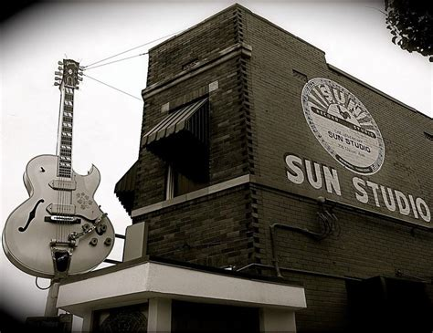

+++
title = "The Search for the Sound: Rhythm and Blues, Rock ’n’ Roll, and the Rise of the Independents"
outputs = ["Reveal"]
[reveal_hugo]
custom_theme = "reveal-hugo/themes/sunblind.css"
slide_number = true
+++

# The Search for the Sound

## Rhythm and Blues, Rock ’n’ Roll, and the Rise of the Independents

{}

- In the 1940s and 1950s, there was a major rise in the number of small independent record labels and recording studios operating outside the major record companies like Columbia, RCA Victor, and Capitol. 
- These independent labels and studios specialized in serving niche music markets for genres like rhythm and blues, country, boogie-woogie, and early rock 'n roll. This music was considered outside the mainstream industry.
{}

---

## Boycotts 

  <iframe width="560" height="315" src="https://www.youtube.com/embed/4WXYjm74WFI?si=OdyLIMZ-HVUtBX2I" title="YouTube video player" frameborder="0" allow="accelerometer; autoplay; clipboard-write; encrypted-media; gyroscope; picture-in-picture; web-share" allowfullscreen></iframe>  
  <iframe width="560" height="315" src="https://www.youtube.com/embed/T_vgfavJ50E?si=nIM-AfDCY8Y_YJH4" title="YouTube video player" frameborder="0" allow="accelerometer; autoplay; clipboard-write; encrypted-media; gyroscope; picture-in-picture; web-share" allowfullscreen></iframe> 

{}
- Two important industry boycotts in the early 1940s helped boost the popularity and distribution of music from independent labels:
   - The 1941 radio boycott of ASCAP-licensed songs gave airplay to BMI-licensed music by artists like Hank Williams and Wynonie Harris instead of hits by Gershwin or Cole Porter.
   - The 1942-44 recording strike opened the market for independent labels willing to sign agreements with musicians' unions when major labels would not.

{}

---

## Independents - King Records

<iframe width="560" height="315" src="https://www.youtube.com/embed/Vzp3hlb1H3A?si=X6mqE3vjxfiCxk-H?t=442" title="YouTube video player" frameborder="0" allow="accelerometer; autoplay; clipboard-write; encrypted-media; gyroscope; picture-in-picture; web-share" allowfullscreen></iframe>
<iframe width="560" height="315" src="https://www.youtube.com/embed/gqkGYhyDkok?si=lQEz1HZojaF_WyYq" title="YouTube video player" frameborder="0" allow="accelerometer; autoplay; clipboard-write; encrypted-media; gyroscope; picture-in-picture; web-share" allowfullscreen></iframe>

{}
- The independent recording studios that proliferated after WWII ranged greatly in their technical capabilities and facilities:
   - Some like Universal in Chicago were highly professional operations rivaling major label studios.
   - Others were makeshift DIY setups in basements, storefronts, or backrooms with equipment cobbled together.
- The increased availability of affordable, quality tape recorders after WWII made high-quality recording more accessible to amateur enthusiasts focused on the music over mastering the technology.
- Independent studio owners provided vital opportunities for aspiring singers, songwriters and musicians to make records and get exposure beyond just their local markets.
- Recording engineers at independent studios often collaborated directly with musicians in ways major labels did not, innovating with sound effects and techniques.
- While also serving advertising clients, independent studios were uniquely driven by a spirit of musical creativity, freedom and openness to experimentation and risk-taking.
- As both symbols and sources of opportunity, independent recording studios played a key role in transforming American musical culture and the record industry in the postwar decades.
{}

---

## Motown 

<iframe width="560" height="315" src="https://www.youtube.com/embed/Gcnjge7XwLk?si=pOoA-E2Hjq0ISrvs" title="YouTube video player" frameborder="0" allow="accelerometer; autoplay; clipboard-write; encrypted-media; gyroscope; picture-in-picture; web-share" allowfullscreen></iframe>

{}
Motown Records in Detroit discovered, recorded, and developed artists and maintained a stable of session musicians that became integral to the Motown Sound
{}

---

## Sun Records

<iframe width="560" height="315" src="https://www.youtube.com/embed/_Q-scxybnp0?si=iD-IiEmS6Rokr8GF" title="YouTube video player" frameborder="0" allow="accelerometer; autoplay; clipboard-write; encrypted-media; gyroscope; picture-in-picture; web-share" allowfullscreen></iframe>

{}
- Sun Records started out as the Memphis Recording Service, which was owner Sam Phillips's part-time recording hobby before evolving into a commercial studio and label.
- Sun Records is mentioned as an example of an independent label and studio that grew from a small operation run by a single owner-operator into a successful company that helped launch major artists. 
- The text states: "The most celebrated example was Elvis Presley, who first came into Sam Phillips’s studio to make a vanity record for his mother."
- This highlights how Sun Records and Phillips provided opportunities for unknown talents like Elvis, who were able to get their start at independent studios and labels like Sun when major labels showed no interest.
- Sam Phillips is also quoted describing himself as a "sound freak" who loved to "play around with sound forever." This exemplifies the experimental spirit and hands-on musical creativity driving many independent studio owners.

So in summary, the introduction uses Sun Records and Sam Phillips as a prime example of the kind of small independent label and studio that helped transform music and the industry in the postwar era through their opportunities for new talent and innovative approaches.
{}

---

## Universal Recording

### Bill Putnam

  <iframe width="560" height="315" src="https://www.youtube.com/embed/C0pAZMZkHpA?si=yEVVWto7mfPaNUT-" title="YouTube video player" frameborder="0" allow="accelerometer; autoplay; clipboard-write; encrypted-media; gyroscope; picture-in-picture; web-share" allowfullscreen></iframe>
  <iframe width="560" height="315" src="afternoon_putnam.pdf" title="YouTube video player" frameborder="0" allow="accelerometer; autoplay; clipboard-write; encrypted-media; gyroscope; picture-in-picture; web-share" allowfullscreen></iframe>

[About | Universal Audio](https://www.uaudio.com/about)

{}

Here is a bullet point summary with redundant information removed:

- Bill Putnam was a pioneering recording engineer and studio owner who helped develop the "Chicago sound" in blues, jazz, and pop in the 1940s-1950s.
- He established Universal Recording in Chicago in the late 1940s, which became a highly successful independent studio. 
- Developed innovative recording techniques like echo chambers, voice-over booths, and the first multi-track consoles.
- Recorded major artists like Nat King Cole, Patti Page, Mahalia Jackson at Universal.
- Used minimal miking originally, like one mic for a whole horn section. Later helped popularize adding reverb and echo effects.
- Started manufacturing mixing consoles and gear under Universal Audio, including the pioneering 1176 limiter. 
- Did early tape recording experiments, including some of the first multi-voice recordings before Les Paul.
- Pioneered half-speed mastering in 1953 to improve fidelity. Valued creative engineering and being a pioneer.
- Founded pioneering LA studios like United Recording and United Western in the late 1950s.
- Recorded many famous R&B, jazz, and pop artists early in their careers.
- Believed great engineers combine technical skill, musical ability, creativity, and patience. 
- Advanced recording techniques and equipment through constant innovation and collaborating with artists.
{}

---

## 1176 Limiter 

<iframe width="560" height="315" src="https://www.youtube.com/embed/XhDTreH0U54?si=MBg-UN_-IvxIe_GC" title="YouTube video player" frameborder="0" allow="accelerometer; autoplay; clipboard-write; encrypted-media; gyroscope; picture-in-picture; web-share" allowfullscreen></iframe>

{}
Here is a summary of the key points from the article "All Buttons In: An investigation into the use of the 1176 FET compressor in popular music production":

- The 1176 compressor, designed by Bill Putnam in 1966, is one of the most popular and revered compressors used in music studios. 
- It uses FET (field effect transistor) technology for gain reduction, which contributes to its fast attack and release times.
- Engineers praise the 1176 for adding pleasing texture and presence to vocals, bass, and drum mixes when used creatively.
- On vocals, the 1176 can create a thick, intimate sound, clamping down quickly on transients. The fastest settings add desirable harmonics.
- On bass guitar, it can increase note definition and punch, altering the amplitude envelope. Faster settings can distort low frequencies. 
- On drum mixes, it brings out ambience and room sound, with the "all buttons in" mode creating extreme compression.
- The 1176 exhibits program-dependent behavior, with the ratio adapting based on input material. This contributes to its unique sound.
- Objective testing has limits in assessing musical compressors. The author did subjective listening tests to hear the 1176's effects.
- The popularity of the 1176 is due to its fast FET-based compression, distortion effects, and how it interacts with different audio sources.
{}

---

## From Polka to Punk: The Cleveland Recording Company

---

## “Hum Your Tune. Hits Start at Schneider Recording”

---

## The Rube Goldberg Approach to Building a Studio: Boddie Recording

---

## “Hit Factory”: Bell Sound Studios, New York City

---

## Recording in Layers

---

## Multi-tracking: Creative Tool or Crutch?

---

## Fixing It in the Mix, and in the Master: Post-Mixing Music, Postponing Decisions

---

## Multi-tracking and the Demise of Live Recording

---

## Recording Jazz: Control versus Spontaneity

---

## Recording Rock: The New Cult(ure) of the Studio

---

